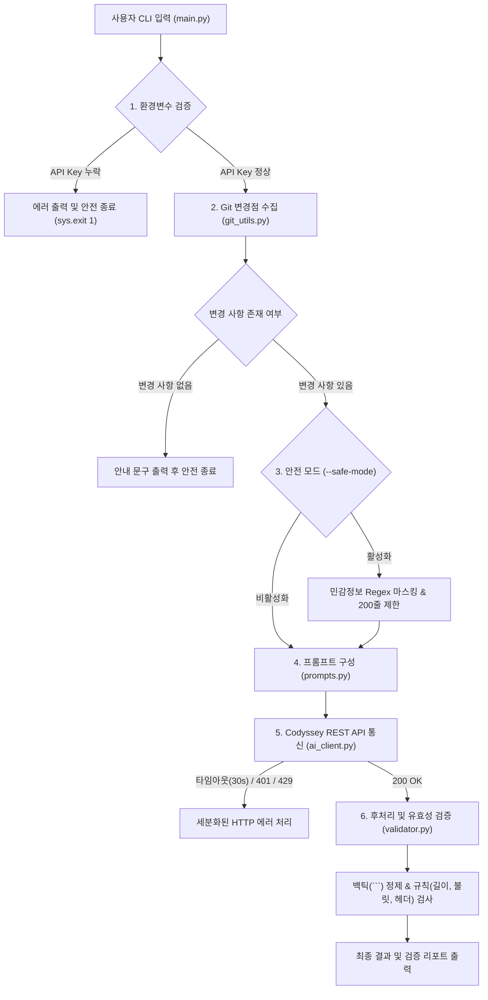

#  시스템 아키텍처 및 설계 보고서 (Architecture & Design)

이 문서는 AI 기반 Git 커밋 및 PR 자동 생성 CLI 도구의 **내부 모듈 설계 의도, 데이터 파이프라인, AI 파라미터 제어 전략 및 체크리스트(B3-2) 답변**을 정리한 기술 문서입니다.

---

## 1. 전체 시스템 파이프라인 다이어그램

---

## 2. 모듈 분리 및 단일 책임 원칙 (SRP)

기존 단일 파일(`main.py`)에 집중되어 있던 책임을 5개의 독립 모듈로 분리하여 유지보수성과 테스트 용이성을 극대화했습니다.

| 모듈 파일 | 담당 역할 (책임) | 분리 이유 (설계 의도) |
| :--- | :--- | :--- |
| **`main.py`** | CLI 파싱 및 전체 흐름 조율 (Orchestrator) | 인터페이스 정의와 비즈니스 로직의 분리 |
| **`git_utils.py`** | Git diff/status 추출 및 민감정보 마스킹 | 로컬 파일시스템/Git I/O 작업의 캡슐화 |
| **`ai_client.py`** | Codyssey REST API 호출 및 네트워크 에러 제어 | 외부 원격 통신 의존성 분리 및 타임아웃/에러 격리 |
| **`prompts.py`** | 커밋 및 PR 프롬프트 템플릿 조립 | LLM 입력(Input) 생성 로직의 독립성 확보 |
| **`validator.py`** | 마크다운 백틱 정제 및 길이/헤더/불릿 검증 | 비결정적 LLM 출력(Output)에 대한 품질 검증 필터 |

###  분리 설계의 핵심 이유
1. **Git 수집과 AI 호출 분리**: 내 로컬 컴퓨터의 Git 저장소 문제(저장소 미지정, 변경점 없음)와 원격 서버의 네트워크 문제(인증 실패, 서버 지연)를 물리적으로 분리하여 에러의 원인을 정확하고 빠르게 식별할 수 있습니다.
2. **프롬프트와 출력 검증 분리**: 프롬프트는 LLM에게 바라는 '요청(Input)'을 정의하고, 검증은 LLM이 이를 준수했는지 사후에 확인하는 '품질 보증(Output Filter)' 역할이므로 책임을 명확히 구분했습니다.

---

## 3. AI 파라미터 설계 및 제어 원리

### 1. `temperature` (생성 다양성)
- **0.0 ~ 0.2 (결정론적 / 보수적)**: 가장 확률이 높은 단어만 선택하여 매 실행마다 균일하고 정제된 결과를 생성합니다. 엄격한 규칙이 중요한 커밋 메시지에 적합합니다.
- **0.7 ~ 1.0 (창의적 / 서술적)**: 문장 구조와 어휘가 다채로워져 PR 설명문의 배경(Why)이나 상세 내용(What)을 풍성하게 서술할 때 유리합니다.

### 2. `max_tokens` (최대 토큰 한도)
- **설정 기준**: 커밋 메시지는 50자 이내 제목과 짧은 요약이므로 300~500 토큰으로 충분하지만, PR 문서는 Why/What/How to Test의 3대 문단과 세부 불릿을 포함해야 하므로 말이 중간에 잘리지 않도록 기본값을 **1000 토큰**으로 여유 있게 설정했습니다.
- **토큰 제한 검증**: `--max-tokens 30`과 같이 극단적으로 낮출 경우, 응답이 중간에 끊기며 본문 불릿 기호 누락 경고가 `validator`에 의해 즉시 감지됩니다.

---

## 4. "후처리/검증" vs "재생성" 설계 트레이드오프

규칙 위반 발생 시 대응 방안으로 **"프롬프트 제약 + 후처리/검증"** 방식을 채택했습니다.

| 비교 항목 | 재생성 (Re-generation) | 후처리 및 유효성 검증 (채택 방식) |
| :--- | :--- | :--- |
| **동작 방식** | 규칙 위반 시 LLM에게 다시 써오라고 재요청 | 프롬프트로 강하게 유도하고, 백틱 제거 및 검증 경고 출력 |
| **응답 속도** | API 호출 횟수만큼 지연 (2~3배 소요) | **단 1회 호출로 즉각적인 응답 제공** |
| **API 비용** | 토큰 소모량 2배 이상 증가 | **비용 최소화 (1회 호출 비용만 소모)** |
| **사용자 경험** | 언제 끝날지 모르는 불확실성 | 신속한 초안 제공 및 경고를 통한 개발자 확인 유도 |

---

## 5. 보안 및 안전 모드 (Safe Mode) 설계

로컬의 소스 코드 diff에 중요한 기밀 정보가 포함되어 외부 LLM API로 유출되는 사고를 차단합니다:
1. **정규표현식(Regex) 기반 마스킹**:
   - `sk-...` (OpenAI Key), `AIza...` (Google API Key), `ey...` (JWT Token)
   - `api_key`, `secret`, `password`, `token` 패턴
   - 개인 식별 정보(Email)
2. **Diff 길이 제한**: 대규모 파일 변경 시 상위 200줄로 슬라이싱하여 비용 과다 발생 및 원치 않는 파일 내용의 유출 위험을 원천 차단합니다.

---

## 6. 실무 적용 관점 및 향후 개선 로드맵

1. **Git Hook 연동 (`prepare-commit-msg`)**: 개발자가 별도의 CLI 명령어를 치지 않아도, 평소처럼 `git commit` 실행 시 백그라운드에서 자동으로 커밋 메시지 초안을 생성하여 에디터에 채워주는 기능.
2. **GitHub API 직접 연동**: 생성된 PR 설명문을 터미널에서 확인한 후, 'Y'를 누르면 브라우저를 열지 않고도 GitHub 원격 저장소에 즉시 PR을 개설(`gh pr create` 또는 REST API 연동)하는 파이프라인 확장.

