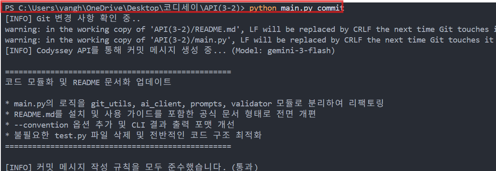
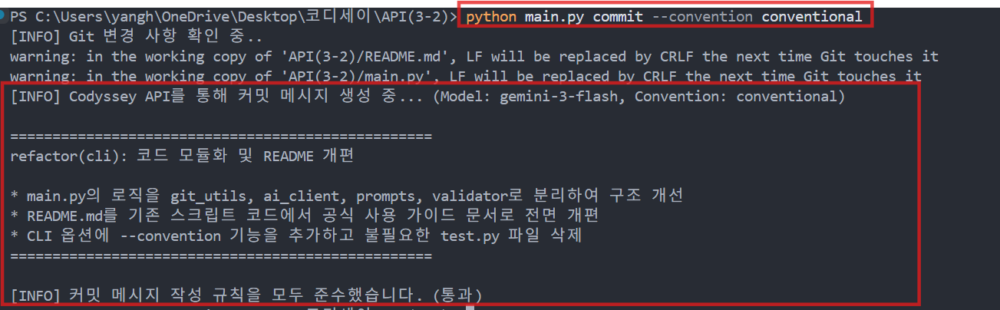
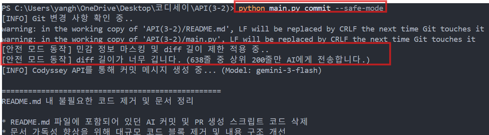
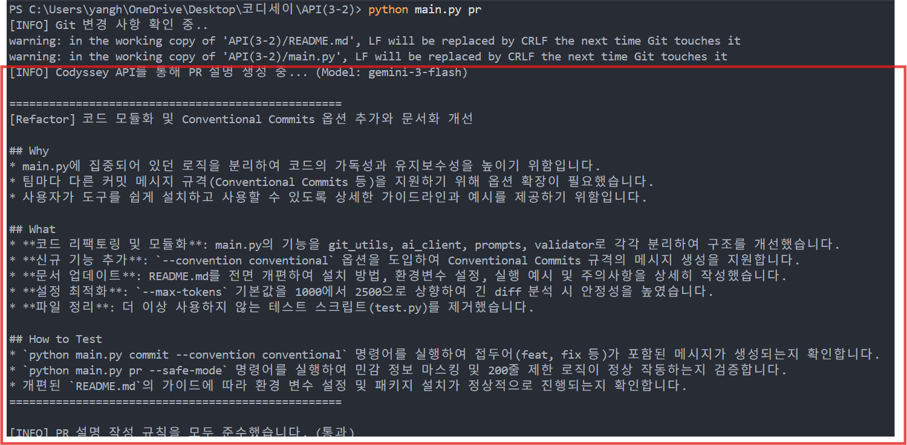
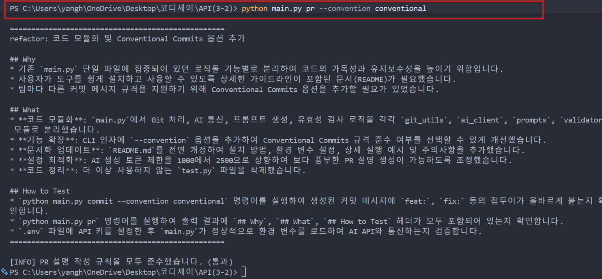
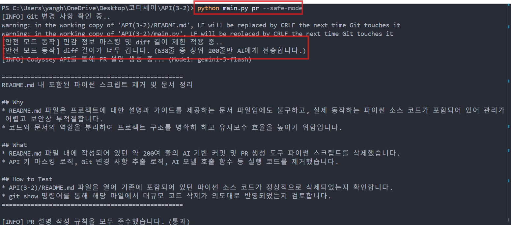
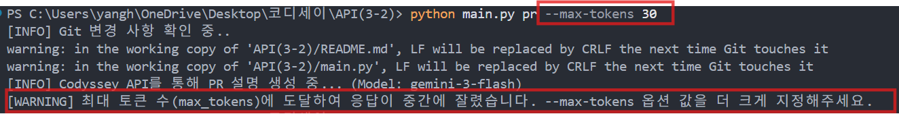
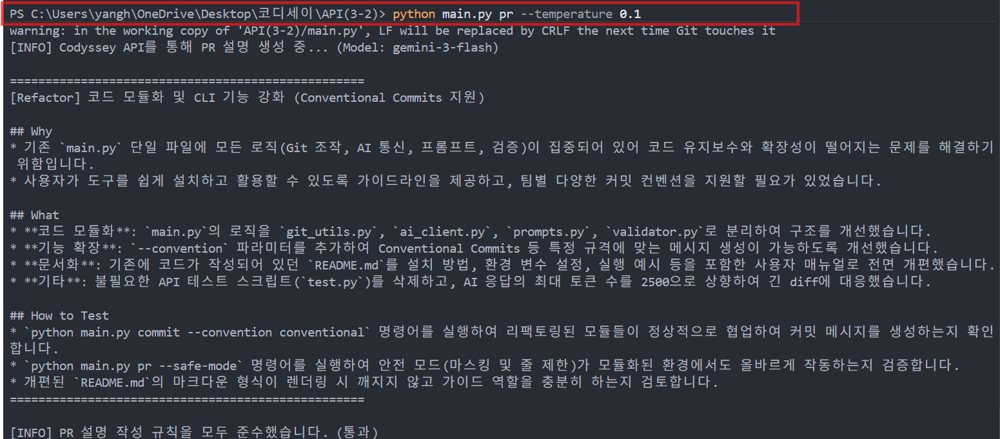
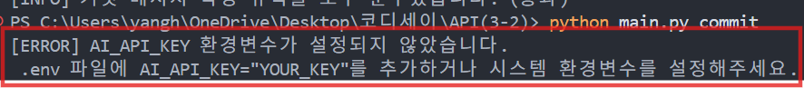
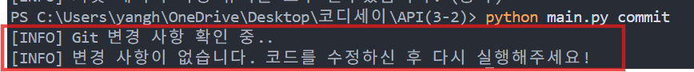

#  과제 수행 및 기능 동작 증빙 보고서 (증빙.md)

이 문서는 **AI 기반 Git Commit & PR 설명 자동 생성 도구**의 각 기능, CLI 옵션, 예외 처리 및 보너스 과제 요구사항이 정상 동작함을 입증하는 실행 증빙 문서입니다.

>  **[사용 가이드(README.md)로 돌아가기](./README.md)**

---

##  목차
1. [기본 및 옵션별 실행 증빙 - Commit](#1-기본-및-옵션별-실행-증빙---commit)
   - 1.1 기본 커밋 메시지 생성 (`commit`)
   - 1.2 팀 컨벤션 적용 커밋 생성 (`--convention conventional`)
   - 1.3 안전 모드 실행 (`--safe-mode`)
   - 1.4 토큰 한도 제어 (`--max-tokens`)
   - 1.5 생성 다양성 제어 (`--temperature`)
2. [기본 및 옵션별 실행 증빙 - PR (Pull Request)](#2-기본-및-옵션별-실행-증빙---pr-pull-request)
   - 2.1 기본 PR 설명문 생성 (`pr`)
   - 2.2 팀 컨벤션 적용 PR 생성 (`--convention conventional`)
   - 2.3 PR 안전 모드 실행 (`--safe-mode`)
   - 2.4 PR 토큰 한도 제어 (`--max-tokens`)
   - 2.5 PR 생성 다양성 제어 (`--temperature`)
3. [예외 상황 처리 증빙](#3-예외-상황-처리-증빙)
   - 3.1 API Key 미설정 시 안내 및 안전 종료
   - 3.2 Git 변경 사항 없음 시 안내 및 안전 종료
4. [보너스 과제 제출 증빙](#4-보너스-과제-제출-증빙)

---

## 1. 기본 및 옵션별 실행 증빙 - Commit

### 1.1 기본 커밋 메시지 생성
- **실행 명령어**: `python main.py commit`
- **검증 내용**: 1줄 제목(50자 이내) + 1줄 공백 후 `*` 불릿 기호 본문 요약 생성 및 검증 통과

---

### 1.2 팀 컨벤션 적용 커밋 생성 (`--convention conventional`)
- **실행 명령어**: `python main.py commit --convention conventional`
- **검증 내용**: Conventional Commits 규칙(`feat:`, `fix:`, `refactor:`, `docs:` 등) 접두사와 스코프가 붙은 제목 및 불릿 요약 생성

---

### 1.3 안전 모드 실행 (`--safe-mode`)
- **실행 명령어**: `python main.py commit --safe-mode`
- **검증 내용**: 정규표현식을 통한 API Key/이메일 등 민감 정보 마스킹 및 200줄 초과 diff 슬라이싱 안내 로그 출력

---

### 1.4 토큰 한도 제어 (`--max-tokens`)
- **실행 명령어**: `python main.py commit --max-tokens <tokens>`
- **검증 내용**: 최대 토큰 수 제어 동작 확인 및 토큰 부족 시 출력 절단에 따른 유효성 검사기(`validator`)의 경고 안내 동작 확인

---

### 1.5 생성 다양성 제어 (`--temperature`)
- **실행 명령어**: `python main.py commit --temperature <float>`
- **검증 내용**: temperature 값에 따른 생성 결과의 어휘 풍부함 및 서술 스타일 변화 검증

---

## 2. 기본 및 옵션별 실행 증빙 - PR (Pull Request)

### 2.1 기본 PR 설명문 생성
- **실행 명령어**: `python main.py pr`
- **검증 내용**: 80자 이내 제목과 함께 필수 3대 헤더(`## Why`, `## What`, `## How to Test`) 및 각 섹션별 불릿(`*`) 요약 생성

---

### 2.2 팀 컨벤션 적용 PR 생성 (`--convention conventional`)
- **실행 명령어**: `python main.py pr --convention conventional`
- **검증 내용**: PR 제목에도 Conventional Commits 접두어가 일관되게 적용된 상세 PR 문서 생성

---

### 2.3 PR 안전 모드 실행 (`--safe-mode`)
- **실행 명령어**: `python main.py pr --safe-mode`
- **검증 내용**: 긴 코드 diff에 대해 민감 정보 마스킹 및 길이 제한을 거친 후 안전하게 PR 설명문 생성

---

### 2.4 PR 토큰 한도 제어 (`--max-tokens`)
- **실행 명령어**: `python main.py pr --max-tokens <tokens>`
- **검증 내용**: PR 문서 생성 시 토큰 파라미터 제어에 따른 분량 조절 동작 확인

---

### 2.5 PR 생성 다양성 제어 (`--temperature`)
- **실행 명령어**: `python main.py pr --temperature <float>`
- **검증 내용**: PR 상세 기술 문구의 문체 다양성 및 디테일 수준 제어 동작 확인

---

## 3. 예외 상황 처리 증빙

### 3.1 API Key 미설정 시 예외 처리
- **테스트 조건**: `.env` 파일의 `AI_API_KEY`가 없거나 설정되지 않은 상태에서 도구 실행
- **검증 내용**: 알 수 없는 시스템 크래시 대신, 사용자가 바로 조치할 수 있는 친절한 에러 문구 출력 및 안전 종료 (`exit code 1`)

---

### 3.2 Git 변경 사항 없음 시 예외 처리
- **테스트 조건**: Git 작업 트리에 변경점(`git status` 및 `git diff`)이 없는 상태에서 도구 실행
- **검증 내용**: 불필요한 AI API 호출을 방지하고 "변경 사항이 없습니다" 안내 문구 출력 후 안전 종료

---

## 4. 보너스 과제 제출 증빙

### 4.1 실제 PR 링크
- **GitHub PR URL**: https://github.com/surilog/codyssey/pull/1

### 4.2 AI 초안 → 최종 PR 5대 변경점 요약본
1. **[톤앤매너 정제]** AI 초안의 경어체/구어체 설명 문장(`~위함입니다`, `~개선했습니다`)을 팀 컨벤션에 맞춰 직관적이고 간결한 개조식 문체(`~방지`, `~추가`)로 정제했습니다.
2. **[원인 및 문맥 명확화]** `## Why` 섹션에서 디코딩 에러가 단순 예방 목적이 아니라, '다른 디렉토리 실행 시 실제로 발생했던 문제'임을 명확히 기술하여 수정 배경을 명확히 했습니다.
3. **[핵심 내용 압축]** `## What` 섹션의 장황한 코드 동작 설명 중 불필요한 서술어를 덜어내고 핵심 변경 파라미터 중심으로 압축하여 가독성을 높였습니다.
4. **[검증 방법 직관화]** `## How to Test` 섹션의 길어진 가이드 문장을 핵심 검증 대상(디코딩 에러 발생 여부 및 README 문구 추가 여부) 위주로 명확히 정리했습니다.
5. **[리뷰 효율성 향상]** 전체적인 서식을 깃허브 PR 표준 양식에 맞게 정돈하여 동료 리뷰어가 핵심 변경 사항과 테스트 방법을 빠르게 파악할 수 있도록 개선했습니다.

### 4.3 컨벤션 적용 전/후 생성 결과 비교
| 구분 | 적용 전 (기본 실행) | 적용 후 (`--convention conventional`) |
| :--- | :--- | :--- |
| **명령어** | `python main.py commit` | `python main.py commit --convention conventional` |
| **생성 결과** | **API 키 마스킹 기능 추가**  * `apply_safe_mode` 함수 구현 * 정규표현식으로 비밀키 마스킹 | **feat(security): API 키 및 민감 정보 마스킹 기능 구현**  * `apply_safe_mode` 함수를 통한 정규식 기반 키 마스킹 * 200줄 초과 diff 자르기 처리 추가 |
| **비교 포인트** | 단순 요약형 제목 작성 | `feat(security):` 접두어와 스코프가 명확히 표시됨 |

