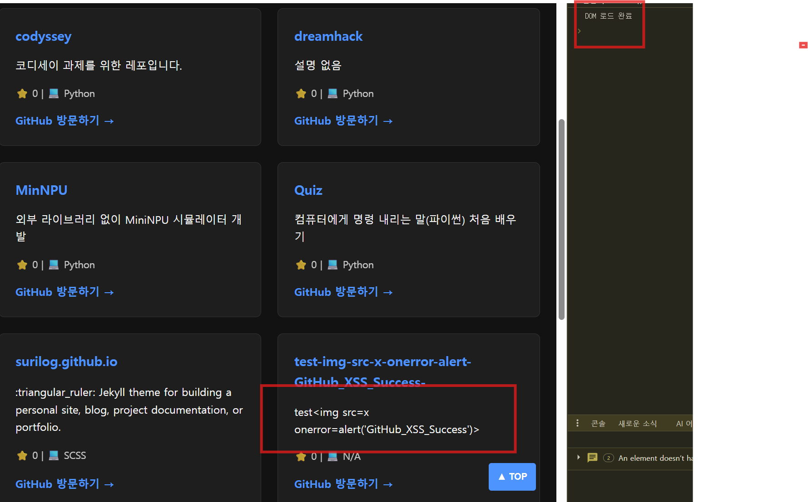
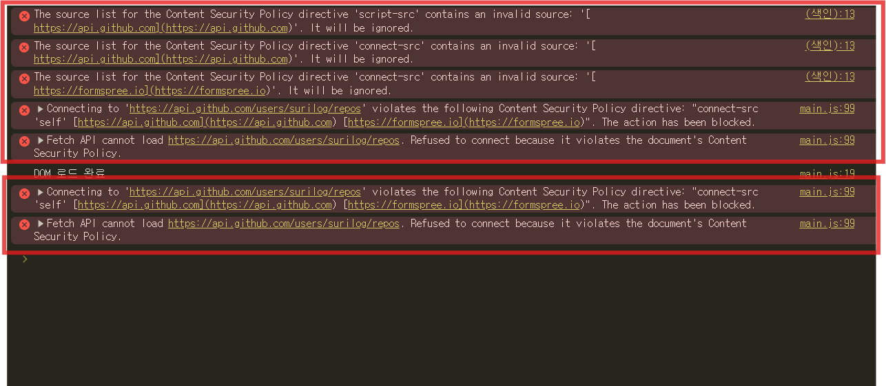

# GitHub API 데이터 렌더링 시 발생 가능한 XSS 분석 및 방어

## 1. 개요 (Overview)
포트폴리오 웹사이트에서 **GitHub Open API (`/users/{username}/repos`)**를 활용하여 저장소 정보(이름, 설명, 언어 등)를 비동기(`fetch`)로 불러와 화면에 렌더링하는 과정에서 **Stored / DOM-Based XSS(Cross-Site Scripting)** 취약점이 발생할 수 있음을 확인했습니다.

이를 해결하기 위해 **1차 방어(`textContent` 기반 이스케이프)**와 **2차 방어(브라우저 레벨 `CSP` 헤더 적용)**를 연계한 **2단계 심층 방어(Defense in Depth)** 메커니즘을 적용하고 실습한 기록입니다.

---

## 2. 취약점 분석 (Vulnerability Analysis)

### 2-1. 취약점 발생 원인
기존 코드에서는 API로부터 받아온 저장소 설명(`repo.description`) 데이터를 이스케이프(Escape) 처리 없이 **템플릿 리터럴과 `innerHTML`**을 사용하여 DOM에 직접 주입하였습니다.

```javascript
//  취약한 기존 코드 (main_2.js)
projectList.innerHTML = projects.map(repo => `
  <div class="project-card">
    <h3>${repo.name}</h3>
    <p>${repo.description}</p> <!--  외부 입력값이 HTML 태그로 해석됨 -->
  </div>
`).join('');

```

### 2-2. 공격 시나리오 (Attack Scenario)

1. **공격자 페이로드 주입**: 공격자는 본인의 GitHub 레포지토리 Description(설명)란에 아래와 같은 악성 스크립트 페이로드를 입력해 둡니다.
```html


```


2. **악성 데이터 수신**: 사용자가 포트폴리오 웹사이트에 접속하면 `fetchGitHubRepos()` 함수가 실행되며 GitHub API로부터 위 페이로드가 포함된 JSON 데이터를 수신합니다.
3. **스크립트 실행**: 수신된 데이터를 `innerHTML`에 대입하는 순간, 브라우저가 `` 태그를 정상적인 HTML 엘리먼트로 파싱합니다.
4. **결과**: 존재하지 않는 이미지 경로(`src=x`)로 인해 `onerror` 핸들러가 트리거되어 공격자가 의도한 악성 자바스크립트(`alert`)가 실행됩니다.


---

## 3. 시큐어 코딩 및 2단계 심층 방어 (Defense in Depth)

단일 방어선에만 의존할 경우 개발자의 실수나 코드 누락 시 취약점에 다시 노출될 수 있으므로, **애플리케이션 레벨**과 **브라우저 레벨**의 2단계 방어 체계를 구축하였습니다.

```
[외부 데이터 인입] 
       │
       ▼
 [1차 코드 방어] ──► textContent 사용 (문자열 이스케이프)
       │
       ▼ (개발자 실수로 innerHTML 잔존 시)
 [2차 정책 방어] ──► CSP (Content Security Policy) 헤더로 스크립트 실행 강제 차단

```

### 3-1. [1차 방어] 소스 코드 레벨: `textContent` 적용

`innerHTML`을 통한 동적 HTML 생성을 배제하고, DOM 객체를 직접 생성하여 **`textContent`** 속성에 입력값을 대입하도록 수정하였습니다.

```javascript
// 🟢 시큐어 코딩 적용 코드 (main_2.js)
function renderProjects(projects) {
  const projectList = document.querySelector('#project-list');
  projectList.innerHTML = ''; // 기존 영역 초기화

  projects.forEach(repo => {
    const card = document.createElement('div');
    card.className = 'project-card';

    const h3 = document.createElement('h3');
    h3.textContent = repo.name;

    //  [핵심 방어 지점] description을 textContent로 이스케이프 처리
    const desc = document.createElement('p');
    desc.textContent = repo.description || '설명 없음';

    const info = document.createElement('div');
    info.className = 'repo-info';
    info.textContent = ` ${repo.stargazers_count} |  ${repo.language || 'N/A'}`;

    const link = document.createElement('a');
    link.href = repo.html_url;
    link.target = '_blank';
    link.rel = 'noopener noreferrer';
    link.textContent = 'GitHub 방문하기 →';

    card.appendChild(h3);
    card.appendChild(desc);
    card.appendChild(info);
    card.appendChild(link);

    projectList.appendChild(card);
  });
}

```


### 3-2. [2차 방어] 브라우저 정책 레벨: CSP (Content Security Policy) 적용

만약 개발자의 실수로 특정 영역에 `innerHTML` 취약점이 잔존하더라도, 브라우저 단에서 인라인 스크립트나 허용되지 않은 이벤트 핸들러(`onerror` 등)의 실행을 차단하도록 `index.html`에 보안 정책을 추가했습니다.

```html
<!-- index.html <head> 영역 내 추가 -->
<meta http-equiv="Content-Security-Policy" 
      content="default-src 'self'; 
               script-src 'self' [https://api.github.com](https://api.github.com); 
               style-src 'self' 'unsafe-inline'; 
               connect-src 'self' [https://api.github.com](https://api.github.com) [https://formspree.io](https://formspree.io); 
               img-src 'self' data: https:;">

```


후에 base-uri도 지정 필요! ==> base-uri 미 지정으로 이한 취약점 발생 가능!
---

## 4. 방어 결과 검증 (Verification)

| 구분 | 1차 방어: `textContent` 적용 | 2차 방어: `CSP` 적용 (innerHTML 잔존 가정) |
| --- | --- | --- |
| **방어 원리** | `<` $\rightarrow$ `&lt;` 등 HTML 엔티티로 자동 이스케이프 | 브라우저 차원에서 정책 위반 스크립트 실행 차단 |
| **실습 결과** | 스크립트 실행 없이 화면상에 태그 문자열 자체가 평문 출력됨 | DOM에는 주입되었으나 `Refused to execute...` 에러 발생하며 차단됨 |

* **`textContent` 결과**: 전달받은 인자값을 단순 문자열(Plain Text)로 처리하여, 화면 상에 `` 텍스트 자체가 안전하게 표기됨을 확인하였습니다.
* **`CSP` 보완 결과**: 코드상 `innerHTML`이 남아있는 상황을 가정하더라도, 브라우저가 CSP 정책 규칙에 의해 `onerror` 핸들러 실행을 차단하고 콘솔 에러를 출력함을 검증하였습니다.

---

## 5. 결론 및 시사점 (Conclusion)

* **외부 API 데이터 신뢰 금지**: 오픈 API나 DB에서 불러오는 데이터라 할지라도 검증되지 않은 외부 입력값(Untrusted Data)으로 간주해야 합니다.
* **근본 대책과 심층 방어**: 사용자 입력이 포함되는 영역에는 `innerHTML` 대신 `textContent`를 사용하여 근본 원인을 제거하고, `CSP` 헤더를 통해 2차 보안망을 구축하는 것이 현대 웹 보안의 핵심입니다.
