##  GitHub 저장소 URL
* **Repository**: [https://github.com/surilog/Quiz.git](https://github.com/surilog/Quiz.git)

---

##  예시 파일 이동
* **퀴즈게임**: [https://github.com/surilog/Quiz/blob/main/main.py](https://github.com/surilog/Quiz/blob/main/main.py)
* **__dict.py**: [https://github.com/surilog/Quiz/blob/main/__dict%EC%9D%B4%EC%9C%A0.py](https://github.com/surilog/Quiz/blob/main/__dict%EC%9D%B4%EC%9C%A0.py)
* **base.py**: [https://github.com/surilog/Quiz/blob/main/base.py](https://github.com/surilog/Quiz/blob/main/base.py)
* **enumerate.py**: [https://github.com/surilog/Quiz/blob/main/enumerate.py](https://github.com/surilog/Quiz/blob/main/enumerate.py)
* **finally활용 이유.py**: [https://github.com/surilog/Quiz/blob/main/finally%ED%99%9C%EC%9A%A9%20%EC%9D%B4%EC%9C%A0.py](https://github.com/surilog/Quiz/blob/main/finally%ED%99%9C%EC%9A%A9%20%EC%9D%B4%EC%9C%A0.py)
* **json영속화 개념.py**: [https://github.com/surilog/Quiz/blob/main/json%EC%98%81%EC%86%8D%ED%99%94.py](https://github.com/surilog/Quiz/blob/main/json%EC%98%81%EC%86%8D%ED%99%94.py)
* **가변객체.py**: [https://github.com/surilog/Quiz/blob/main/mutable_object.py](https://github.com/surilog/Quiz/blob/main/mutable_object.py)
 
---

##  개발 환경 설정

본 프로젝트는 아래의 환경에서 개발 및 테스트되었습니다.

* **IDE**: Visual Studio Code
* **Language**: Python 3.12.2
* **Version Control**: Git

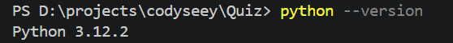
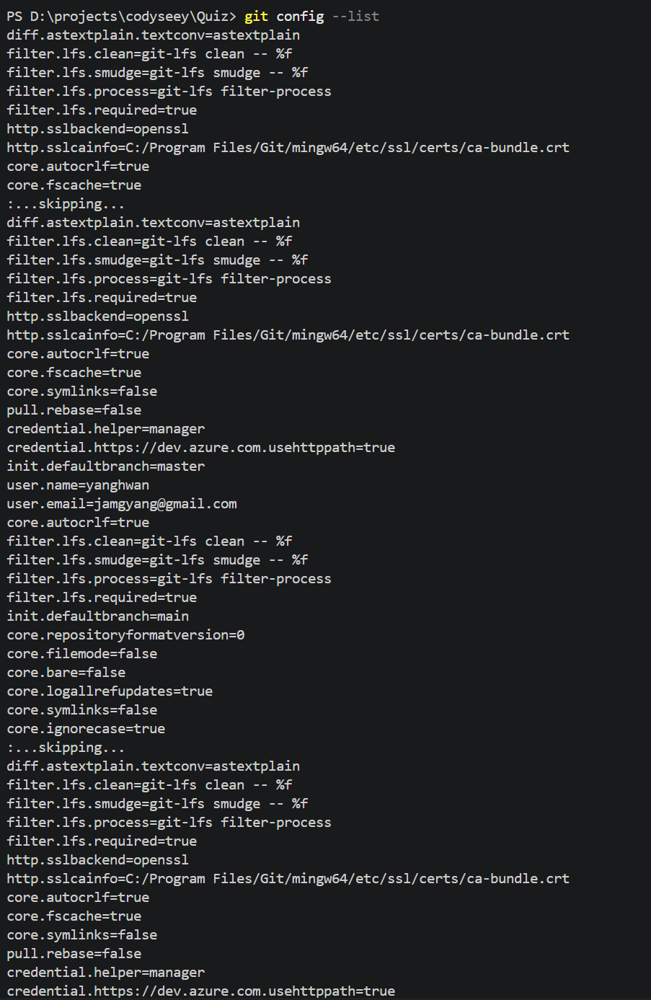
> *VSCode 터미널 내 Python 버전(`python --version`) 및 Git 사용자 설정(`git config --list`) 확인 화면*

---

##  Git 커밋 및 브랜치 이력 (`git log`)

의미 있는 커밋 단위 분리와 브랜치 생성/병합(Merge) 과정을 관리했습니다.

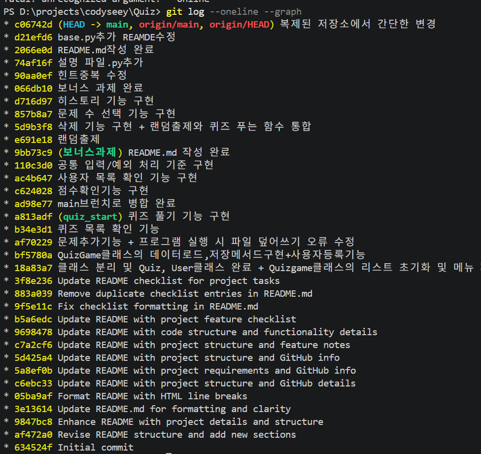


## 기능 요구 사항

- [x] Git 저장소 설정<br>
- [x] 메뉴 기능<br>
- [x] 공통 입력/예외 처리 기준 (최소 요구)<br>
- [x] Quiz 클래스<br>
- [x] 기본 퀴즈 데이터<br>
- [x] 퀴즈 풀기 (브랜치 활용)<br>
- [x] 퀴즈 추가<br>
- [x] 퀴즈 목록<br>
- [x] 점수 확인<br>
- [x] QuizGame 클래스<br>
- [x] 파일 저장/불러오기 (**state.json**)<br>
- [x] README.md 작성<br>
- [x] Git 저장소 복제 실습<br>

## 파이썬 CLI 퀴즈 게임 (Python Quiz Game)

* 이 프로젝트는 파이썬(Python)으로 제작된 터미널(CLI) 기반의 객관식 퀴즈 프로그램입니다.<br>

* 사용자 관리, 퀴즈 관리, 점수 누적 및  최고 점수 추적 기능을 제공하며, 모든 데이터는 JSON 파일로 자동 영속화됩니다.<br>
---

## 프로젝트 개요

* **개발 언어**: Python 3.12.2
* **데이터 저장 방식**: JSON (`state.json`)
* **주요 특징**:
  * 터미널 기반의 직관적인 메뉴 CLI 인터페이스
  * 사용자별 누적 포인트 및 개인 최고 점수 기록
  * 사용자 점수 실시간 갱신
  * 예외 처리(Ctrl+C, 파일 손상 등) 및 안전한 데이터 자동 저장 (`finally` 구문 활용)

---

## 퀴즈 주제 및 선정 이유

* **주요 주제**: **개발자 기초 지식 (도커, 파이썬 OOP, 파일 시스템)**
* **선정 이유**:
  * **개발 환경 실무 역량 검증**: 상대경로/절대경로의 개념, Docker Images 명령 및 `docker-compose`의 `depends_on` 동작 원리 등 실제 개발 환경 구축 시 필수적인 핵심 지식을 다룹니다.
  * **객체지향 프로그래밍(OOP) 이해도 점검**: 파이썬 상속 및 메서드 오버라이딩 실행 결과를 직접 추론해 봄으로써 프로그래밍 기초 체력을 점검할 수 있도록 구성했습니다.
  * **기본 지식 점검** : 첫 번째 과제에서 다루었던 내용들과 두 번째 과제를 수행하기 위한 기본적인 지식을 점검하고자 했습니다.

---


## 실행 화면

#### 1. 퀴즈 풀기 진행
등록된 사용자를 선택하여 4지선다 객관식 퀴즈를 풀고 정답 여부를 확인하는 화면입니다.


#### 2. 사용자 등록
프로그램을 실행한 사용자가 등록되었는지 안되어 있는지 확인하고 안되었으면 등록하는 화면입니다.
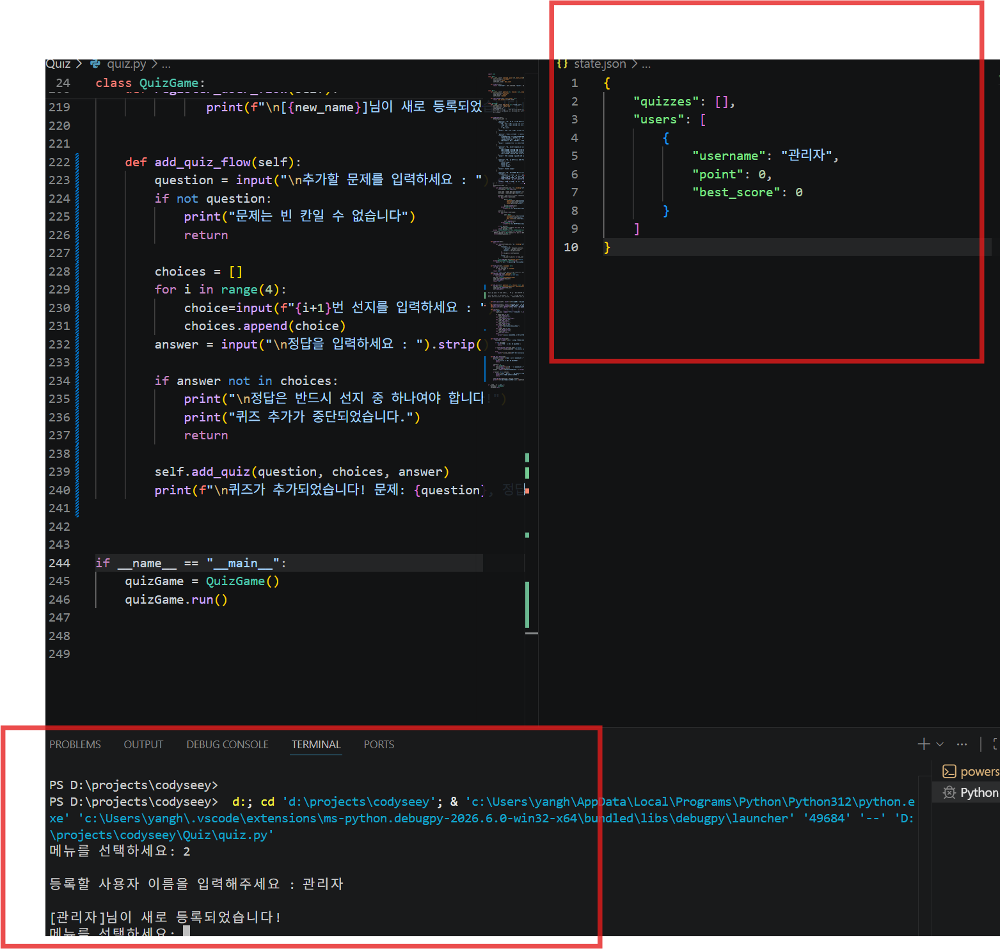

#### 3. 사용자 목록
등록된 사용자들의 이름과 최고 점수를 알려주는 화면입니다.


#### 4. 점수 확인
점수를 확인하고픈 사용자의 점수를 확인하는 것 입니다.
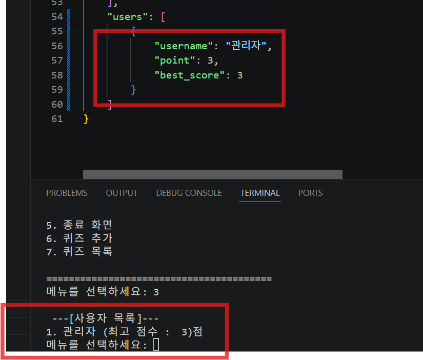

#### 5. 종료 화면
메인 메뉴에서 '5'를 입력시 프로그램이 종료되는 화면입니다.
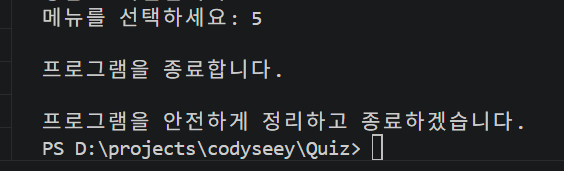

#### 6. 퀴즈 추가
등록된 사용자가 퀴즈를 추가하는 화면입니다.
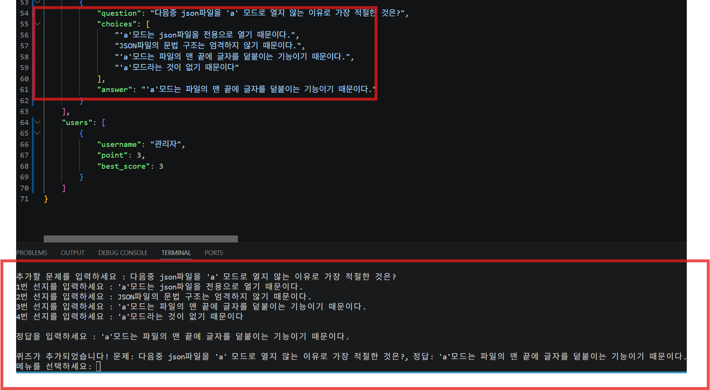

#### 7. 퀴즈 목록
현재 저장된 퀴즈 목록을 확인하는 화면입니다.
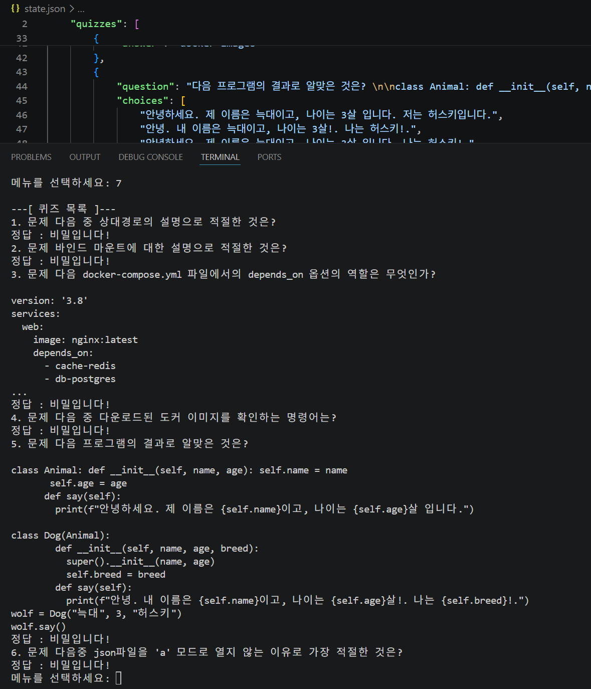

#### 8. 예외처리 기준
"비정상 종료" 방지와 파일이 없거나 손상되었을 경우 기본 퀴즈 데이터로 복구하는 화면입니다.

**빈 state.json파일**
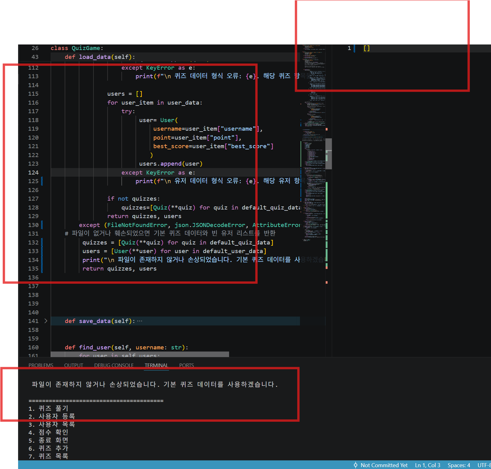

**기본 퀴즈 데이터로 복구 된 state.json파일**


**위의 과정의 증거**


#### 9. 공통 입력

**메뉴 선택 시 최소 케이스 처리**
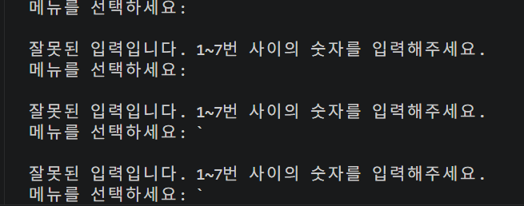

**정답 선택 시 최소 케이스 처리**


#### 10. 랜덤 출제
랜덤 출제 메뉴 선택시 quizzes에서 문제들을 섞고 이를 start_quiz_flow에서 가져가 실행합니다.
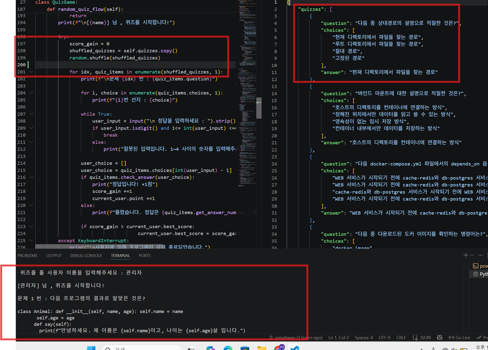

#### 11. 퀴즈 삭제 기능

퀴즈 삭제 메뉴 선택 시 현재 저장된 state.json의 quizzes목록들을 번호에 맞게 보여주고 번호 선택시 그 문제가 삭제됩니다.
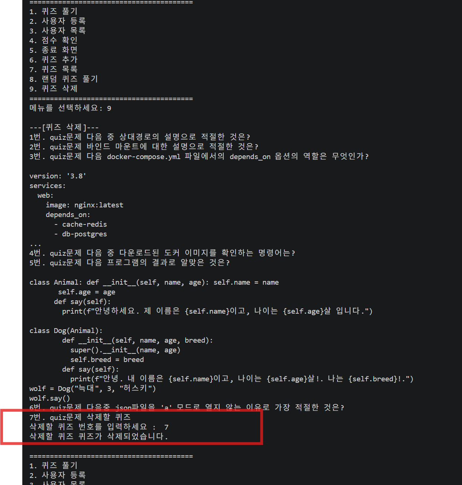
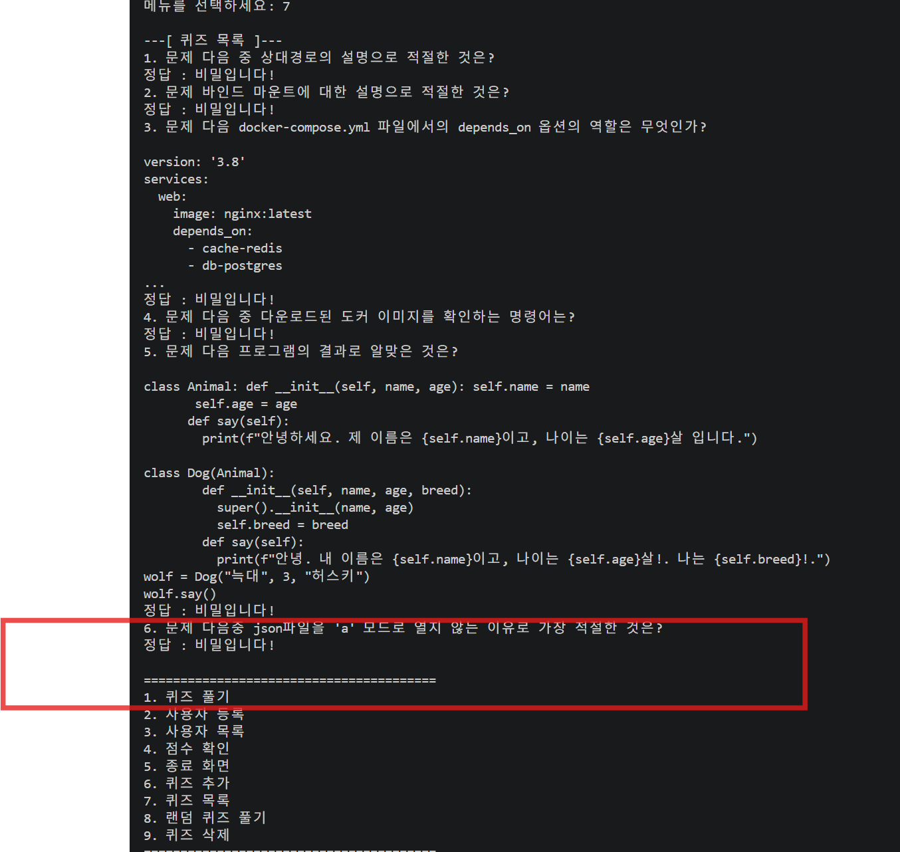

#### 12. 문제 수 선택 
퀴즈 시작 후 사용자가 문제 수를 선택할 수 있게 해줍니다!
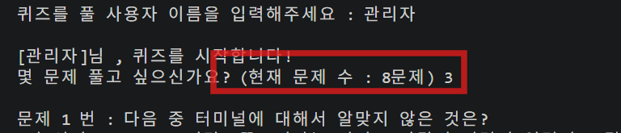


#### 13. 힌트 기능
퀴즈 시작 후 사용자가 문제 당 1번 1pt 차감하고 힌트를 확인 할 수 있습니다.
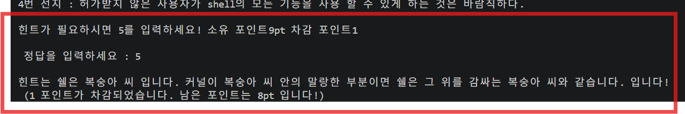


#### 14. 점수 기록 히스토리
사용자 목록과 사용자 점수 확인에서 각각 등록된 날짜, 점수, 최고점수, 게임 플레이 횟수를 알 수 있습니다.
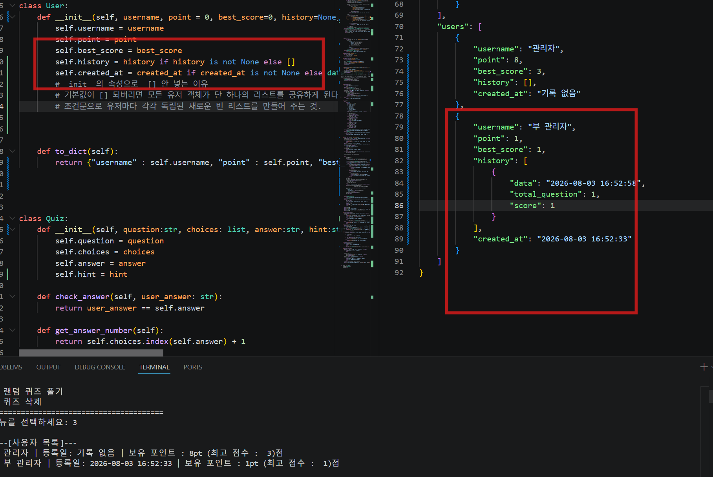


## 실행 방법

### 1. 사전 요구사항
* Python 3.10 이상이 설치되어 있어야 합니다.

### 2. 프로그램 실행
* 별도의 외부 라이브러리 설치 없이 파이썬 표준 라이브러리만으로 실행할 수 있습니다.

```bash
python main.py
```

## 주요 기능 목록
| 번호 | 기능명 | 설명 |
| :---: | :--- | :--- |
| **1** | **퀴즈 풀기** | 등록된 사용자를 선택하여 객관식(4지선다) 퀴즈를 진행합니다. 정답 시 포인트가 획득되며 라운드 최고 점수가 갱신됩니다. |
| **2** | **사용자 등록** | 새로운 사용자를 시스템에 등록합니다. (중복 이름 등록 불가) |
| **3** | **사용자 목록** | 현재 등록된 모든 사용자의 이름, 누적 포인트, 개인 최고 점수를 조회합니다. |
| **4** | **점수 확인** | 특정 사용자의 현재 포인트, 개인 최고 점수를 확인합니다. |
| **5** | **종료 화면** | 안전하게 데이터를 저장하고 프로그램을 종료합니다. |
| **6** | **퀴즈 추가** | 새로운 퀴즈 문제, 4개의 선지, 정답을 직접 입력하여 시스템에 추가합니다. |
| **7** | **퀴즈 목록** | 현재 등록된 모든 퀴즈의 문제 항목을 출력합니다. |


## 추가 기능 목록
| 번호 | 기능명 | 설명 |
| :---: | :--- | :--- |
| **1** | **랜덤 출제** | 랜덤 출제 선택시 문제 순서가 섞인 quizzes를 가져옵니다. |
| **2** | **퀴즈 삭제 기능** | 퀴즈 목록의 번호 중 원하는 번호를 입력시 삭제합니다. |
| **3** | **문제 수 선택** | 퀴즈문제를 풀 때 문제 수를 선택 할 수 있게 해줍니다. |
| **4** | **힌트 기능** | 문제를 풀던 중 모르는 것이 있을 때 포인트를 차감하여 힌트를 확인 할 수 있습니다. |
| **5** | **점수 기록 히스토리** | 최고 점수 뿐만 아니라 모든 게임 기록을 저장합니다(날짜/시간, 푼 문제 수, 점수 등등) |

## 파일 구조

```plaintext
.
├── main.py                # 퀴즈 게임 전체 메인 로직 및 CLI 실행 파일
├── state.json             # 퀴즈, 사용자 데이터, 히스토리가 저장되는 JSON 데이터베이스 (자동 생성)
├── README.md              # 프로젝트 안내 및 포트폴리오 문서
├── .gitignore             # Git 버전 관리 제외 설정 파일
│
├── images/                # README용 기능 및 실행 화면 스크린샷
│   └── play/
│       ├── branch.png
│       ├── check_point.png
│       ├── choice_except.png
│       ├── choice_question.png
│       ├── default_data.png
│       ├── delete_quiz1.png
│       ├── delete_quiz2.png
│       ├── except1.png
│       ├── except2.png
│       ├── exit.png
│       ├── git1.png
│       ├── gitclone.png
│       ├── gitclone0.png
│       ├── gitlog.png
│       ├── gitpull.png
│       ├── hint.png
│       ├── history.png
│       ├── menu_except.png
│       ├── python.png
│       ├── quiz_list.png
│       ├── quiz_play.png
│       ├── random.png
│       ├── user_list.png
│       └── user_register.png
│
└── [학습 & 개념 검증 예시 예제 코드]
    ├── __dict이유.py       # 객체 속성 직렬화(__dict__) 및 to_dict() 학습 파일
    ├── enumerate.py        # enumerate() 인덱스 순회 학습 파일
    ├── finally활용 이유.py  # try-except-finally 예외 처리 및 데이터 저장 검증 파일
    ├── json영속화.py        # json.loads() 및 dict.get() 하위 호환성 예제
    └── mutable_object.py   # 가변 객체(Mutable) 기본 매개변수 함정 예제
  ```

## 데이터 파일 설명 (state.json)

### 1. 경로 및 역할

**경로**: 프로젝트 QUIZ 디렉토리 내 /state.json

**역할**: 프로그램이 실행될 때 데이터를 로드하고, 새로운 퀴즈/사용자 등록 또는 게임 종료 시 현재 변경 상태를 자동으로 반영·저장합니다. <br>
파일이 없거나 손상되었을 경우 기본 퀴즈 데이터로 자동 복원 및 초기화됩니다.<br>


### 2. 데이터 스키마 (JSON Schema)

```json
{
  "quizzes": [
    {
      "question": "문제 내용 (문자열)",
      "choices": [
        "1번 선지",
        "2번 선지",
        "3번 선지",
        "4번 선지"
      ],
      "answer": "정답 텍스트 (choices 배열에 존재하는 값과 일치해야 함)"
    }
  ],
  "users": [
    {
      "username": "사용자 이름 (문자열)",
      "point": 0,          // 누적 획득 포인트 (정수)
      "best_score": 0     // 한 라운드에서의 개인 최고 점수 (정수)
    }
  ]
}
```


## 디버깅 및 트러블 슈팅


### 1. 사용자 등록 시 이전의 state.json파일이 삭제되는 오류 발생.

**사용자 등록 오류**
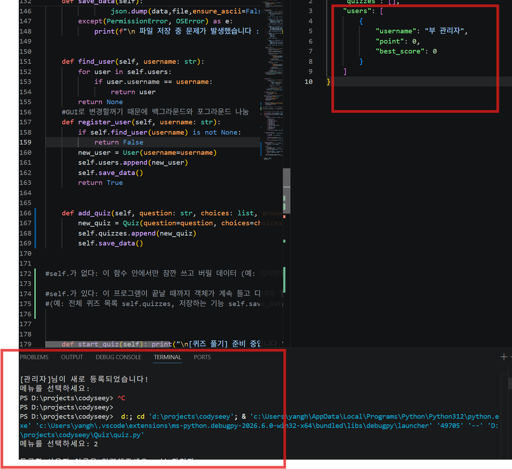
**사용자 등록 디버깅 과정**
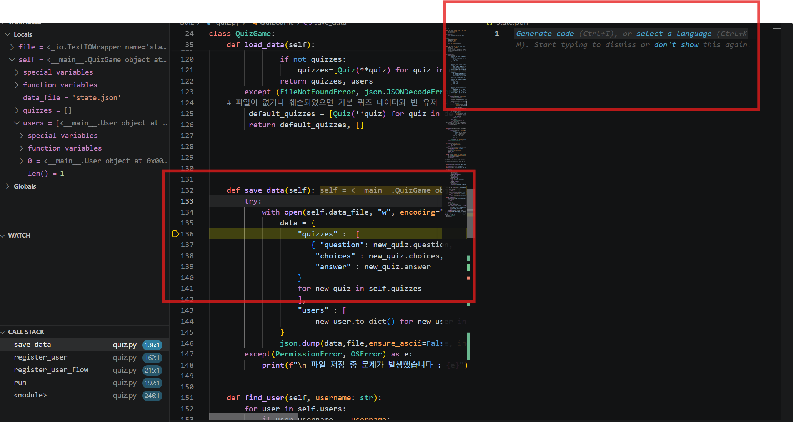
**해결**
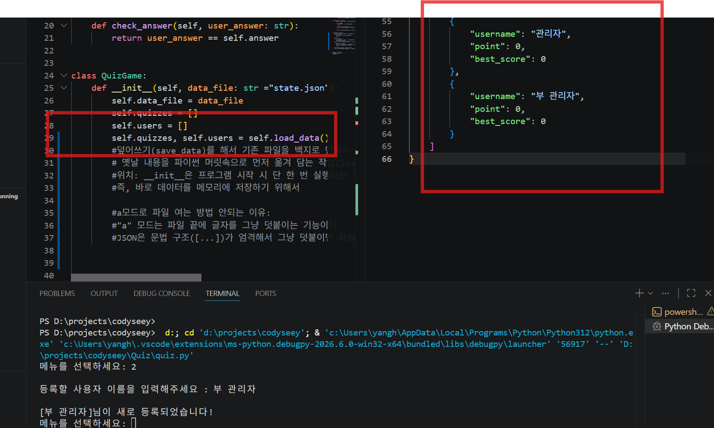


### 2. 문제 시작 후 등록되지 않은 사용자 입력시 예외 처리!

**등록되지 않은 사용자 입력시 예외처리 실패**
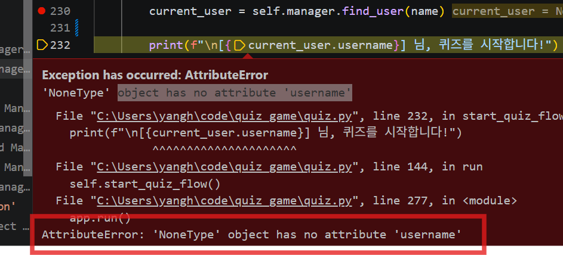
**등록되지 않은 사용자 입력시 예외처리 성공**
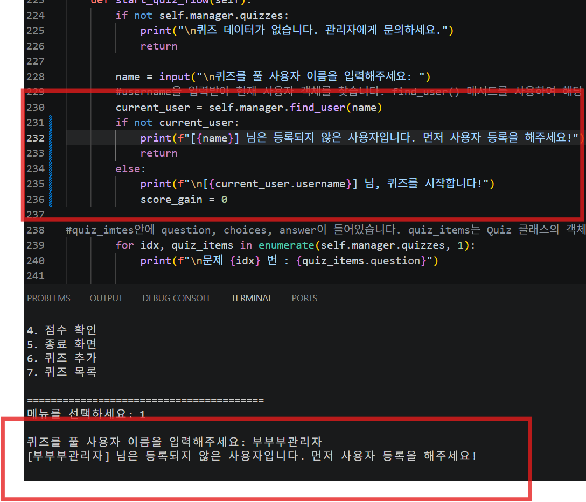

### 3. 잘못된 선지 입력 시 무한루프 발생!

**범위에서 벗어난 선지 입력 시 무한 루프 발생**
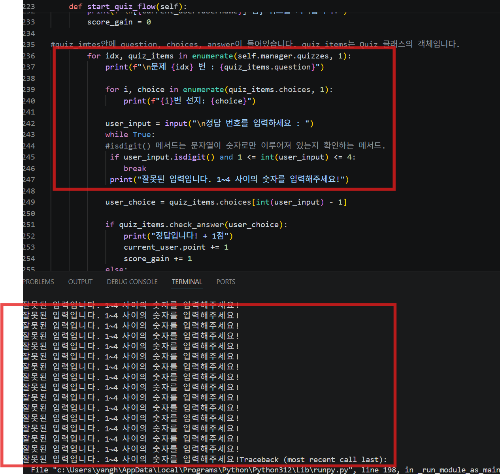
**해결**
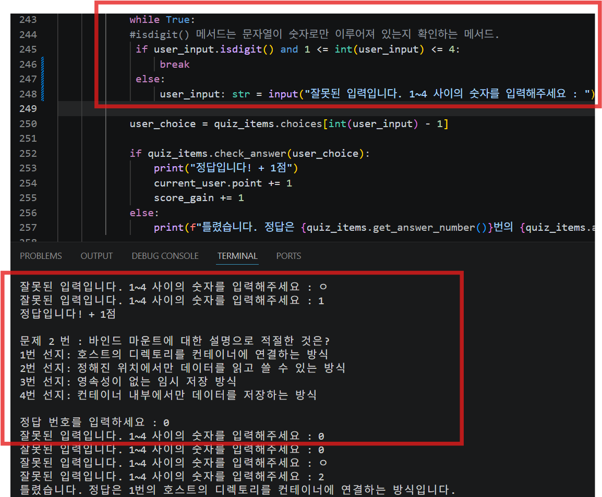

### 4. enumerate 함수 활용
**enumerate 함수 디버깅 과정1**
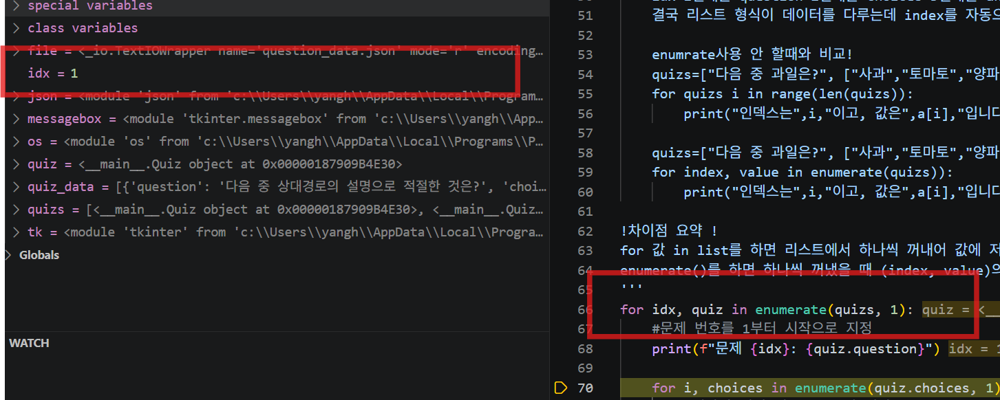
**enumerate 함수 디버깅 과정2**
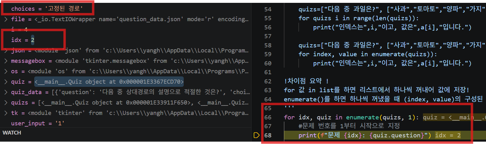
