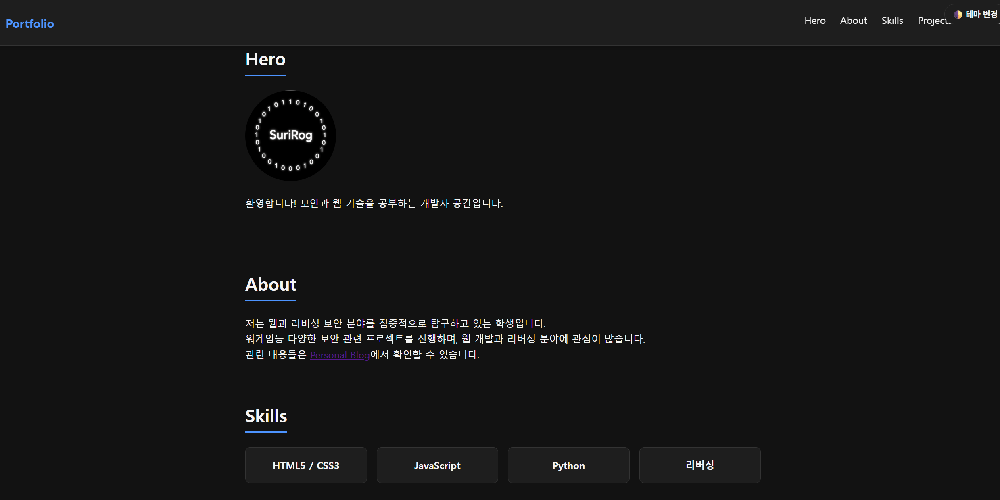
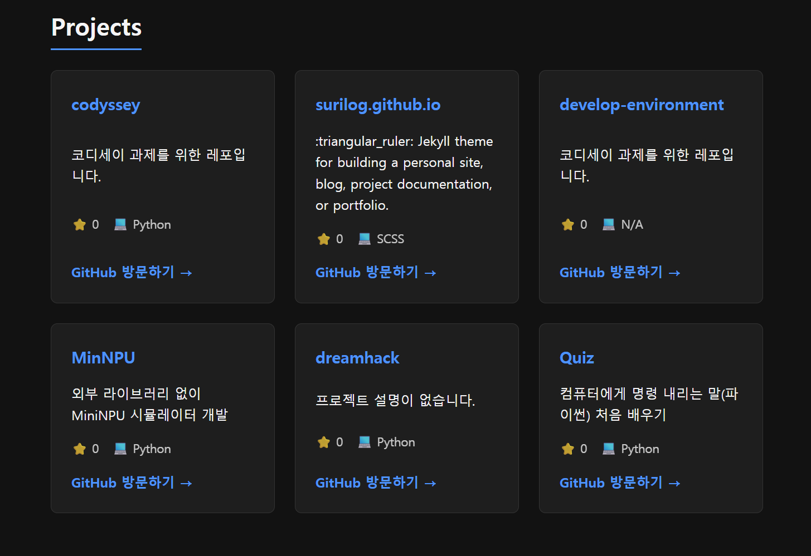
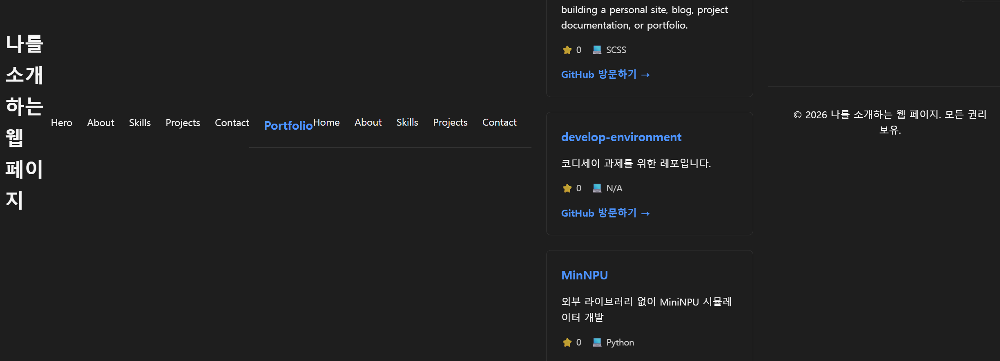

# 🌐 웹 포트폴리오 웹사이트

시맨틱 마크업과 바닐라 자바스크립트를 활용하여 제작한 개인 소개 및 프로젝트 포트폴리오 웹사이트입니다.

##  배포 링크
- **웹사이트 URL**: https://surilog.github.io/codyssey/

##  사용 기술 스택 (Tech Stack)
- **HTML5**: 시맨틱 태그 기반의 웹 접근성 고려 구조 설계
- **CSS3**: Flexbox & Grid 레이아웃, CSS 변수(`:root`, `[data-theme="dark"]`) 다크모드, 반응형 미디어 쿼리
- **JavaScript (ES6+)**: Vanilla JS DOM 조작, IntersectionObserver 스크롤 애니메이션, Contact 폼 유효성 검사
- **API**: GitHub REST API 연동 (`fetch` / `async/await`)

##  주요 화면 스크린샷
| 메인 화면 (다크모드) | 프로젝트 카드 (GitHub API) |
| :---: | :---: |
|  |  |

##  주요 기능 및 임계값(Threshold) 설정

### 1. 주요 기능
- **반응형 레이아웃**: 모바일, 태블릿, PC 화면 크기에 맞춘 가변 레이아웃 (768px 브레이크포인트)
- **다크 모드 지원**: 사용자 테마 선택 및 `localStorage`를 활용한 설정 상태 유지
- **GitHub API 연동**: `async/await` 및 `fetch`를 활용한 최신 프로젝트 저장소 실시간 데이터 로드 (로딩/성공/에러/빈 상태 4가지 UI 표현)
- **부드러운 스크롤 & Top 버튼**: 사용자 경험(UX)을 향상시키는 스크롤 인터랙션
- **Contact 폼 유효성 검사**: 필수값 및 이메일 정규식 검증, 실시간 에러 메시지 노출

### 2. 임계값(Threshold) 설정 명시
- **스크롤 탑 버튼 노출 기준**: 스크롤 Y축 **`300px`** 이상 이동 시 버튼 노출
- **내비게이션 스티키/배경 변경 기준**: 스크롤 Y축 **`60px`** 이상 이동 시 `.scrolled` 클래스 부여
- **스크롤 애니메이션 (IntersectionObserver)**: 요소 노출 비율 **`threshold: 0.2`** (화면 내 20% 노출 시 Fade-In 동작)

---

##  트러블슈팅 (Troubleshooting)

### 1. 반응형 레이아웃 깨짐 및 가로 스크롤 발생 문제


* **문제 현상 (Issue)**
  - GitHub Pages 배포 및 브라우저 확인 시, 상단 헤더와 메인 섹션, 푸터가 세로로 적층되지 않고 가로 한 줄로 배치되어 화면 우측으로 길게 늘어나는 현상 발생
  - 모바일 디바이스 접속 시 반응형으로 전환되지 않고 요소들이 찌그러짐

* **원인 분석 (Root Cause)**
  - `index.html` 내부에 `<header>` 태그가 중첩(`Header inside Header`)되어 들어가고, `<nav>` 내비게이션 태그가 중복으로 작성됨
  - 부모 `<header>`의 `position: relative` 기준점 누락으로 인해 모바일 햄버거 메뉴(`nav ul.active`)의 `position: absolute` 설정이 레이아웃 위치를 이탈시킴
  - `<head>` 태그 내 반응형 필수 메타 태그인 `<meta name="viewport" content="width=device-width, initial-scale=1.0">` 설정 누락

* **해결 방법 (Solution)**
  1. **HTML 구조 정화**: 중첩된 `<header>` 및 중복 내비게이션 항목 삭제
     ```html
     <!-- 구조 단순화 및 단일 헤더 구성 -->
     <header>
       <h1><a href="#">Portfolio</a></h1>
       <button id="hamburger-btn" aria-label="메뉴 열기">...</button>
       <nav><ul id="nav-menu">...</ul></nav>
       <button id="theme-toggle">🌓 테마 변경</button>
     </header>
     ```
  2. **CSS 레이아웃 수립**: `body` 요소에 `overflow-x: hidden` 속성을 추가하여 가로 스크롤 방지 및 `header`의 `position: sticky`와 `z-index`를 재설정하여 고정 축 형성
  3. **반응형 뷰포트 확보**: `<head>` 내 `viewport` 메타 태그 적용으로 기기 폭에 맞춘 반응형 분기점(768px) 정상 동작 완료

---

### 2. GitHub Pages 배포 중 서브모듈(Submodule) / 중첩 Git 에러

* **문제 현상 (Issue)**
  - GitHub Pages 자동 빌드 과정에서 `fatal: No url found for submodule path 'codyssey' in .gitmodules` 에러 발생하며 빌드 실패

* **원인 분석 (Root Cause)**
  - 프로젝트 하위 폴더 내부에 독립적인 `.git` 숨김 폴더가 남아있어 Git이 이를 일반 폴더가 아닌 **'중첩된 Git 저장소(Embedded Git Repository)'** 및 서브모듈로 인식함

* **해결 방법 (Solution)**
  - PowerShell 터미널을 통해 하위 폴더 내부의 `.git` 폴더 및 깨진 캐시 추적 삭제 후 재푸시
    ```powershell
    # 중첩된 .git 폴더 삭제
    Remove-Item -Recurse -Force codyssey\.git

    # Git 캐시 초기화 및 일반 폴더 재등록
    git rm -r --cached codyssey
    git add .
    git commit -m "fix: convert embedded repo to normal folder"
    git push origin main
    ```