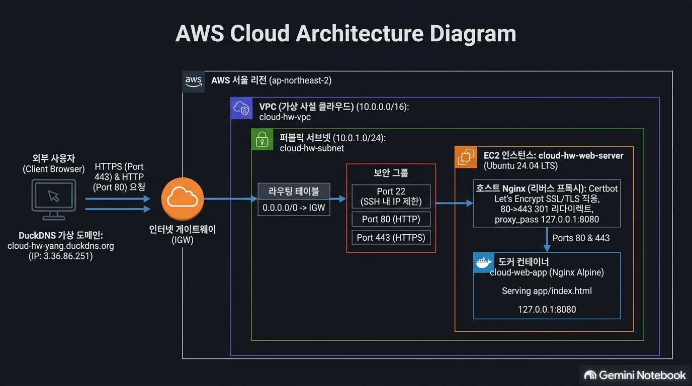
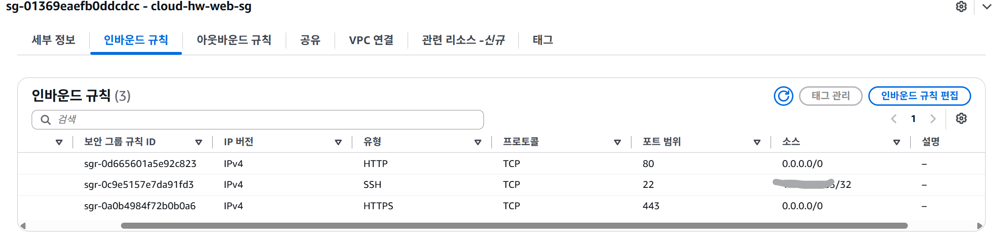
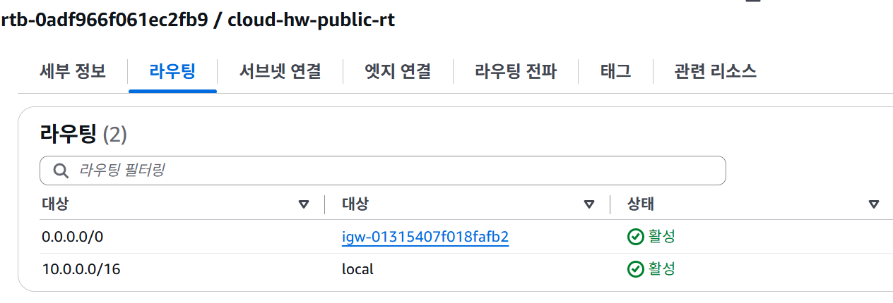
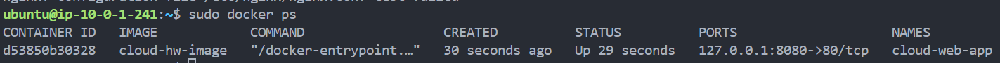
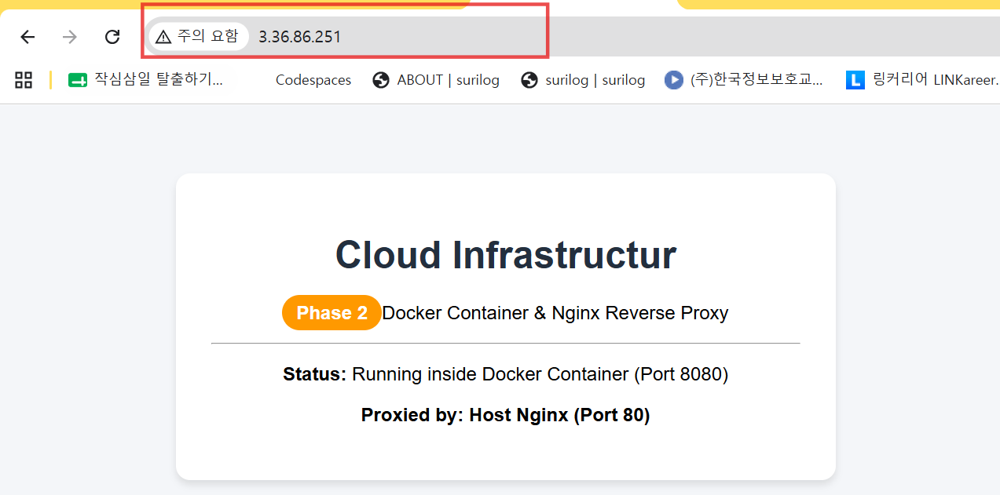
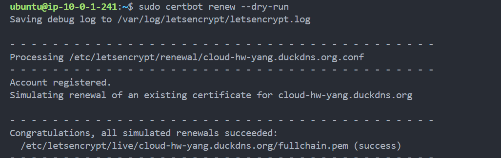
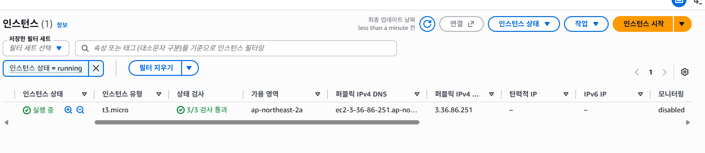
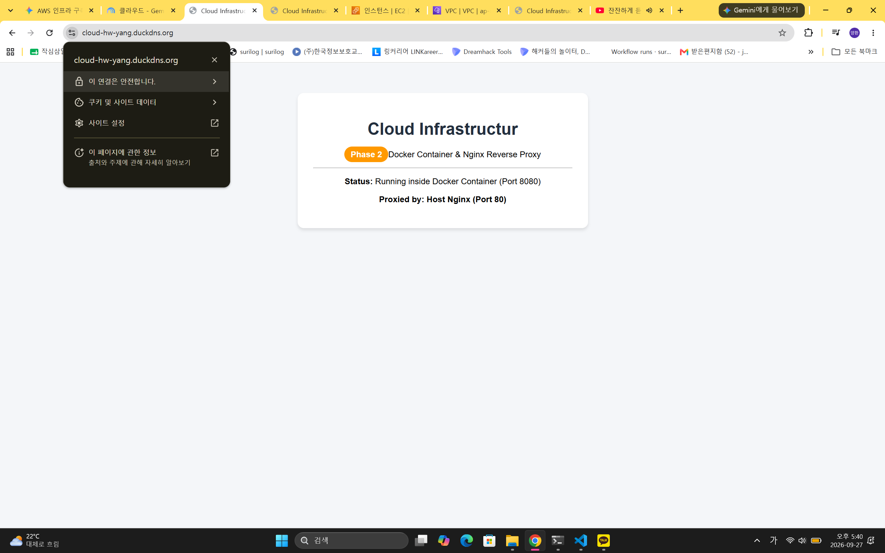

# AWS 클라우드 인프라 자동화 &amp; Docker/HTTPS 구축 프로젝트

본 프로젝트는 AWS 서울 리전(`ap-northeast-2`) 환경에서 **AWS 콘솔 기반 수동 인프라 구축** 경험을 바탕으로, **AWS CLI 자동화**, **Docker 컨테이너화**, **HTTPS 보안 통신**으로 확장한 프로젝트입니다.

---

## Repository Structure

기초 과제 문서와 심화 과제실행 코드 및 자동화 스크립트를 통합 정리한 구조

```
cloud-hw/
├── README.md                  # 본 통합 프로젝트 안내 및 전체 가이드
├── Dockerfile                 # Phase 2: Nginx Alpine 기반 Docker 이미지 빌드 파일
├── .gitignore                 # 보안 준수 (*.pem 키 파일 및 임시 파일 Git 제외)
├── app/
│   └── index.html             # 커스텀 웹 애플리케이션 메인 페이지
├── nginx/
│   └── site.conf              # Phase 2: Host Nginx 리버스 프록시 설정 파일
├── scripts/
│   ├── create-infra.sh        # Phase 1: AWS CLI 인프라 자동 생성 스크립트 (IaC)
│   ├── provision.sh           # Phase 2: Docker/Nginx 자동 설치 및 배포 스크립트
│   ├── setup-ssl.sh           # Phase 3: DuckDNS + Certbot SSL/TLS 자동화 스크립트
│   └── teardown-infra.sh      # Phase 1~3: 인프라 자원 일괄 삭제 스크립트 (과금 방지)
└── docs/                      # 전체 증빙 문서 및 아키텍처 다이어그램 통합
    ├── architecture.png       # 전체 클라우드 인프라 아키텍처 다이어그램
    ├── troubleshooting.md     # 트러블슈팅 종합 보고서 (Phase 0 ~ Phase 3)
    ├── cleanup-checklist.md   # 리소스 삭제 및 과금 방지 통합 체크리스트
    └── screenshots/           # 단계별 검증 증빙 스크린샷 모음
```

##  아키텍처 다이어그램 (System Architecture)




###  기본 접속 정보

* **서비스 URL (HTTPS)**: [https://cloud-hw-yang.duckdns.org](https://www.google.com/url?sa=E&amp;q=https%3A%2F%2Fcloud-hw-yang.duckdns.org)
* **DuckDNS 서브도메인**: `cloud-hw-yang.duckdns.org`
* **EC2 퍼블릭 IP**: `3.36.86.251`
* **대상 리전**: 아시아 태평양 (서울) `ap-northeast-2`

###  Request Flow (트래픽 흐름)

```
[사용자 브라우저]
       │ (HTTPS :443 / HTTP :80)
       ▼
[DuckDNS (cloud-hw-yang.duckdns.org / 3.36.86.251)]
       │
       ▼
[AWS Internet Gateway (igw)]
       │
       ▼
[Public Subnet (10.0.1.0/24)]
       │
       ▼
[Security Group (22: 관리자 IP/32, 80: Anywhere, 443: Anywhere)]
       │
       ▼
[Host Nginx (Reverse Proxy)]
       │ ── (HTTP :80 요청 시 HTTPS :443으로 301 Redirect)
       │ ── (proxy_pass http://127.0.0.1:8080)
       ▼
[Docker Container (cloud-web-app :8080)]
       │
       ▼
[Nginx Alpine Web Server (app/index.html)]

```

---

##  Security (보안 설정 및 최소 권한 원칙)

본 프로젝트는 AWS 클라우드 보안 모범 사례인 **최소 권한의 원칙(Principle of Least Privilege)**을 철저하게 준수하여 구축되었습니다.

###  IAM (Identity and Access Management)

* **루트 계정 사용 지양**: AWS Root 계정 대신 최소 권한이 부여된 전용 IAM 사용자(`cloud_test`)를 생성하여 모든 작업 수행
* **권한 범위 최소화**: EC2, VPC 관리 등 필수 정책만 할당하여 보안 리스크 제어

###  Security Group (인바운드 / 아웃바운드 방화벽)

* **SSH (22번 포트) 접속 제한**: `0.0.0.0/0` 전체 개방을 허용하지 않고, 관리자의 **특정 퍼블릭 IP (`/32`)**만 등록하여 외부 무차별 대입 공격(Brute Force) 차단
* **HTTP / HTTPS (80, 443번 포트)**: 불특정 다수의 웹 서비스를 위해 `0.0.0.0/0` 전역 허용
* **컨테이너 포트 외부 격리**: Docker 컨테이너의 `8080` 포트는 Security Group 규칙에 추가하지 않고, **`127.0.0.1` 루프백 바인딩**을 적용해 외부 직접 접속을 물리적으로 차단



---

##  Network Routing (네트워크 라우팅 및 아키텍처)

VPC(Virtual Private Cloud)를 기반으로 외부와 통신 가능하면서도 격리된 맞춤형 클라우드 네트워크 라우팅 환경을 구성하였습니다.

### VPC 및 서브넷 구조

* **VPC**: `10.0.0.0/16` CIDR 블록 지정 (`cloud-hw-vpc`)
* **Public Subnet**: `10.0.1.0/24` CIDR 할당 (`cloud-hw-subnet`, 가용 영역: `ap-northeast-2a`)  
  * `MapPublicIpOnLaunch=true` 설정을 통해 인스턴스 생성 시 외부 통신용 퍼블릭 IP 자동 할당

###  인터넷 게이트웨이 및 라우팅 테이블 (Route Table)

* **Internet Gateway (IGW)**: `cloud-hw-igw`를 생성하고 VPC에 바인딩하여 외부 인터넷과 통신하는 통로 확보
* **Route Table 라우팅 규칙**:  
  * Destination `0.0.0.0/0` ➔ Target `cloud-hw-igw` 설정으로 외부 트래픽을 IGW로 포워딩하여 서브넷을 **Public Subnet**으로 동작하게 정의



---

##  Docker 컨테이너화 및 Nginx 리버스 프록시

독립된 컨테이너 환경에서 애플리케이션을 구동하고, Host Nginx를 리버스 프록시로 연결하는 2단 아키텍처를 구축했습니다.

### Docker 이미지 빌드

* **베이스 이미지**: `nginx:alpine` 경량화 이미지를 활용해 보안 허점 축소 및 경량화
* **Dockerfile 구성**:  
```  
FROM nginx:alpine  
COPY app/index.html /usr/share/nginx/html/index.html  
EXPOSE 80  
CMD ["nginx", "-g", "daemon off;"]  
```
* **Docker 이미지 빌드**:  
```  
sudo docker build -t cloud-hw-image .  
```

###  Docker 컨테이너 실행 및 접속 성공 인증

* **127.0.0.1 포트 바인딩 실행**:  
```  
sudo docker run -d \
    --name cloud-web-app \
    --restart always \
    -p 127.0.0.1:8080:80 \  
    cloud-hw-image  
```
* **접속 성공 인증 1 (`docker ps`)**:  
```  
sudo docker ps  
```

  * `cloud-web-app` 컨테이너가 `127.0.0.1:8080-&gt;80/tcp` 상태로 정상 구동됨을 확인.
* **접속 성공 인증 2 (로컬 `curl` 검증)**:  
```  
curl -I http://127.0.0.1:8080  
```

  * `HTTP/1.1 200 OK` 응답 및 커스텀 HTML 소스 출력 확인.



###  Host Nginx 리버스 프록시 접속 인증

* **Nginx 프록시 설정 (`/etc/nginx/sites-available/default`)**:  
```  
server {  
    listen 80;  
    server_name _;  
    location / {  
        proxy_pass http://127.0.0.1:8080;  
        proxy_set_header Host $host;  
        proxy_set_header X-Real-IP $remote_addr;  
        proxy_set_header X-Forwarded-For $proxy_add_x_forwarded_for;  
        proxy_set_header X-Forwarded-Proto $scheme;  
    }  
}  
```
* **Nginx 접속 인증**:  
  * 외부에서 80번 포트로 들어온 HTTP 요청이 Host Nginx를 거쳐 `127.0.0.1:8080` Docker 컨테이너로 전달되어 " Cloud Infrastructure " 메인 페이지 정상 출력 확인.




---

## DuckDNS &amp; Certbot HTTPS (SSL/TLS) 적용

###  DuckDNS 가상 도메인 연동

* **무료 DDNS 발급**: DuckDNS에서 `cloud-hw-yang.duckdns.org` 도메인을 생성하고 EC2 퍼블릭 IP(`3.36.86.251`) 매핑

###  Certbot Let's Encrypt SSL/TLS 적용

* **Certbot Nginx 자동 연동**:  
```  
sudo certbot --nginx -d cloud-hw-yang.duckdns.org --non-interactive --agree-tos -m your_email@example.com --redirect  
```
* **HTTP ➔ HTTPS 301 리다이렉트**: HTTP(80) 접속 시 HTTPS(443) 보안 모드로 자동 전환 설정
* **인증서 자동 갱신 검증**:  
```  
sudo certbot renew --dry-run  
```

  * `Congratulations, all simulated renewals succeeded` 메시지로 90일 주기 자동 갱신 작동 정상 검증.



---

## 인프라 구성 상세 (Infrastructure Details)

| 구분                   | 주요 설정 및 리소스 사양                                                              | 비고 / 보안 설정                   |
| -------------------- | --------------------------------------------------------------------------- | ---------------------------- |
| **AWS Region**       | `ap-northeast-2` (서울 리전)                                                    | 기본 리전 고정                     |
| **VPC**              | `10.0.0.0/16` (`cloud-hw-vpc`)                                              | 태그: `Project=cloud-hw`       |
| **Public Subnet**    | `10.0.1.0/24` (`cloud-hw-subnet`, `ap-northeast-2a`)                        | 퍼블릭 IP 자동 할당                 |
| **Internet Gateway** | `cloud-hw-igw`                                                              | VPC 바인딩 및 라우터 매핑             |
| **Route Table**      | `0.0.0.0/0` ➔ `cloud-hw-igw`                                                | 외부 통신(Public Subnet)         |
| **EC2 Instance**     | `t3.micro` (Ubuntu 24.04 LTS, EBS 8GiB `gp3`)                               | 인스턴스명: `cloud-hw-web-server` |
| **Key Pair**         | `cloud-hw-key` (`cloud-hw-key.pem`)                                         | SSH 권한 설정 (`chmod 400`)      |
| **Security Group**   | `SSH(22)`: 관리자 IP만 (`/32`)`HTTP(80)`: `0.0.0.0/0` `HTTPS(443)`: `0.0.0.0/0` | 8080 포트는 외부 차단               |
| **Reverse Proxy**    | Host Nginx (`/etc/nginx/sites-available/default`)                           | `127.0.0.1:8080` 포워딩         |
| **Container**        | `cloud-web-app` (`nginx:alpine` 기반)                                         | `-p 127.0.0.1:8080:80`       |
| **SSL/TLS**          | Let's Encrypt (`Certbot`)                                                   | `certbot renew --dry-run` 검증 |

---

##  리포지토리 파일 구조 (Repository Structure)

```
cloud-hw-advanced/
├── app/
│   └── index.html             # 1. 커스텀 웹 애플리케이션 메인 페이지
├── docs/
│   ├── architecture.png       # 인프라 구성 아키텍처 다이어그램
│   ├── troubleshooting.md     # 트러블슈팅 상세 보고서
│   └── cleanup-checklist.md   # 리소스 일괄 삭제 검증 체크리스트
├── nginx/
│   └── site.conf              # 2. Host Nginx 리버스 프록시 설정
├── scripts/
│   ├── create-infra.sh        # Phase 1: AWS CLI 인프라 자동 생성 스크립트
│   ├── provision.sh           # Phase 2: Docker/Nginx 자동 설치 및 배포 스크립트
│   ├── setup-ssl.sh           # Phase 3: DuckDNS + Certbot SSL/TLS 자동화 스크립트
│   └── teardown-infra.sh      # Phase 1~3: 태그 기반 인프라 자원 일괄 삭제 스크립트
├── Dockerfile                 # 3. Nginx Alpine 기반 Docker 이미지 빌드 파일
└── README.md                  # 본 최종 설명 문서

```

---

##  제출 증빙 스크린샷 가이드

  * AWS 콘솔 EC2 인스턴스 목록에서 `cloud-hw-web-server`가 `Running` 상태이며 퍼블릭 IP `3.36.86.251` 및 태그 `Project=cloud-hw`가 정상 적용된 화면

  

  * 인바운드 규칙(22, 80, 443) 및 라우팅 테이블(`0.0.0.0/0 -&gt; igw`) 설정 화면
   
   

  * `sudo docker ps` 실행 결과 및 `curl -I http://127.0.0.1:8080` (HTTP 200 OK) 화면
     

  * 브라우저 주소창에 `https://cloud-hw-yang.duckdns.org` 접속 시 안전한 연결(자물쇠 아이콘)과 함께 웹 페이지가 표시되는 화면
     

  * `sudo certbot renew --dry-run` 실행 후 성공 메시지가 출력된 화면
     


---

##  주요 트러블슈팅 요약 (Troubleshooting Summary)

| 구분       | 주요 증상 및 오류 메시지                                                          | 원인 분석                                             | 해결 방법 (Action)                                                         |
| -------- | ----------------------------------------------------------------------- | ------------------------------------------------- | ---------------------------------------------------------------------- |
| **이슈 1** | CLI 실행 시 `Bad jmespath expression` 및 백슬래시 오동작                           | 코드 복사 시 언더바(`_`) 및 이스케이프 문자로 인한 JMESPath 파싱 에러    | `--query 'sort_by(Images, &amp;CreationDate)[-1].ImageId'` 구문 정리 및 백슬래시 제거 |
| **이슈 2** | Nginx 설정 테스트 중 `unknown "schema" variable` 오류 발생                        | `site.conf` 파일 내 Nginx 내장 변수 오타 (`$schema`)       | `proxy_set_header X-Forwarded-Proto $scheme;`으로 `$scheme` 오타 수정        |
| **이슈 3** | EC2 run-instances 후 `Waiter InstanceRunning failed: Invalid id: "None"` | `--query` 결과 추출 시 배열 접근 구문 미흡으로 인스턴스 ID `None` 반환 | `Instances.InstanceId` 쿼리 수정 및 인스턴스 정리 후 스크립트 재실행                      |

---

##  리소스 일괄 삭제 (Cost Prevention)

```
bash ./scripts/teardown-infra.sh

```

* **삭제 순서**: EC2 인스턴스 ➔ 보안 그룹 ➔ 인터넷 게이트웨이 ➔ 라우팅 테이블 ➔ 서브넷 ➔ VPC (`cloud-hw-vpc`)