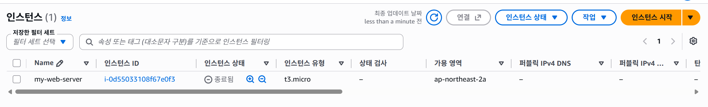
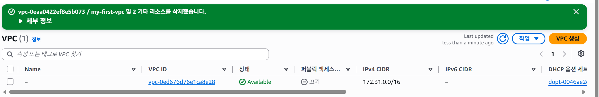
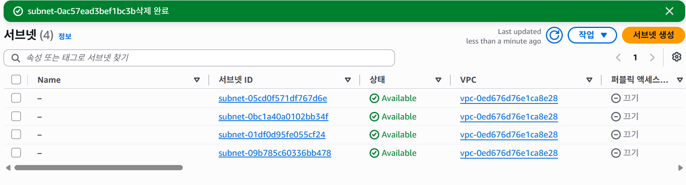
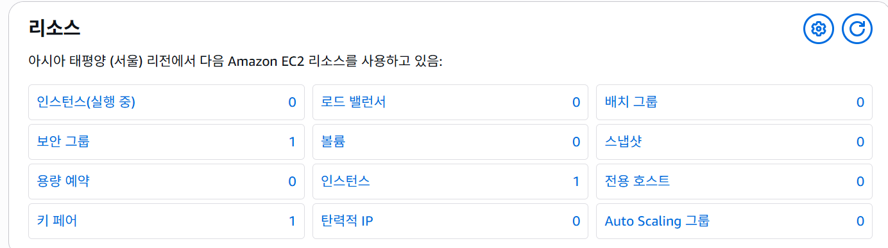
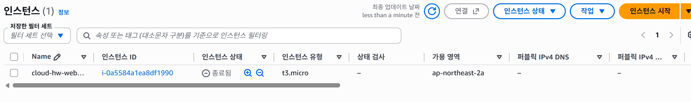
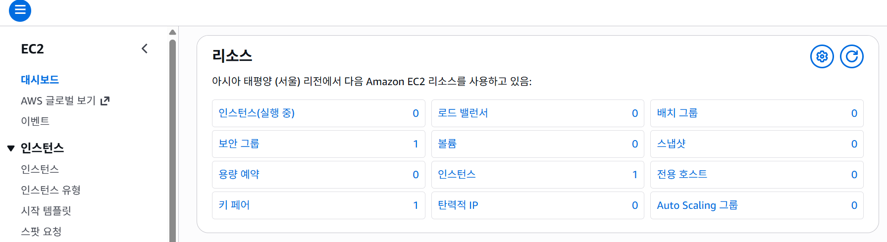

#  AWS 리소스 정리 체크리스트 (Cleanup Checklist)

## 1. 개요

본 문서는 AWS 클라우드 과제 수행 완료 후, 불필요한 자원으로 인한 요금 청구(과금)를 방지하기 위해 생성했던 모든 인프라 자원을 안전하게 해제 및 삭제했음을 증명하는 체크리스트입니다.

* **작성일자**: 2026-09-23
* **대상 리전**: 서울 리전 (`ap-northeast-2`)


* **프로젝트 VPC**: `10.0.0.0/16` (`my-first-vpc`)


---

## 2. 리소스 정리 순서 및 삭제 항목 체크리스트

AWS 리소스 간의 의존성(Dependency)에 의해 아래 표시된 **순서대로 삭제**를 진행해야 오류 없이 완전히 정리됩니다.

| 순서 | 리소스 구분 | 대상 자원 이름 / ID | 조치 내용 | 정리 상태 |
| --- | --- | --- | --- | --- |
| **1** | **EC2 인스턴스** | `my-web-server` | 인스턴스 종료 (**Terminate**) 처리

 | [x] 완료 |
| **2** | **EBS 볼륨** | `vol-xxxxxxxx` (Root 8~10GiB) | EC2 종료 시 자동으로 함께 삭제됨 확인

 | [x] 완료 |
| **3** | **탄력적 IP (EIP)** | *(할당받았을 경우)* | EIP 연결 해제(Unassociate) 및 릴리스(**Release**)

 | [x] 완료 |
| **4** | **보안 그룹 (SG)** | `web-server-sg` | EC2 종료 확인 후 인바운드 규칙 포함 삭제 (**Delete**)

 | [x] 완료 |
| **5** | **인터넷 게이트웨이** | `my-igw` | VPC에서 분리(**Detach**) 후 인터넷 게이트웨이 삭제

 | [x] 완료 |
| **6** | **라우팅 테이블** | `my-public-rt` | 서브넷 연결 해제 및 사용자 지정 라우팅 테이블 삭제

 | [x] 완료 |
| **7** | **퍼블릭 서브넷** | `public-subnet-1` | 서브넷 삭제 (**Delete**)

 | [x] 완료 |
| **8** | **VPC** | `my-first-vpc` | 최종 VPC 삭제 (**Delete VPC**)

 | [x] 완료 |

---

## 3. 세부 리소스 삭제 검증 및 증빙 스크린샷

### ■ 3-1. EC2 인스턴스 종료 (Terminated)

* EC2 콘솔에서 인스턴스 상태가 `Terminated`로 변경되었으며, 연동된 EBS 볼륨이 자동으로 함께 해제되었음을 확인함.



---

### ■ 3-2. VPC 및 네트워크 인프라 삭제

* 인터넷 게이트웨이 분리(`Detach`), 서브넷 삭제 후 `my-first-vpc`가 완전히 제거되어 VPC 목록에 기본(Default) VPC만 남아 있음을 확인함.



---

---


### ■ 3-3. 과금 위험 자원 릴리스 및 최종 점검

* EC2 대시보드 메인에서 **실행 중인 인스턴스(Running Instances)가 `0`개**로 표시됨을 최종 검증.



---

## 4. 과금 방지 최종 점검 (Billing Dashboard)

AWS 결제 대시보드(Billing & Cost Management)를 통해 현재 활성화된 과금 요소가 없음을 확인했습니다.

* [x] **EC2 Running Instances**: 0 대
* [x] **Unattached EBS Volumes**: 0 개
* [x] **Unassociated Elastic IPs**: 0 개
* [x] **Active NAT Gateways / Load Balancers**: 0 개

## 5.  심화 학습 IaC 스크립트 자동 인프라 정리

## 5-1 자동화 스크립트 실행 기록 (`teardown-infra.sh`)

심화 학습 과정에서 AWS CLI 스크립트로 생성한 인프라 자원을 `teardown-infra.sh` 스크립트를 통해 자동으로 일괄 해제하였습니다.

* **실행 명령어**:  
```  
bash ./scripts/teardown-infra.sh  
```
* **터미널 실행 로그**:  
```  
[Phase 1] 'cloud-hw' 프로젝트 인프라 자원 삭제를 시작합니다...
- EC2 인스턴스 종료 중: i-0a5584a1ea8df1990  
  인스턴스가 완전히 종료(Terminated)될 때까지 대기 중...  
  EC2 인스턴스 종료 완료!
- 보안 그룹 삭제 중: sg-01369eaefb0ddcdcc  
  { "Return": true, "GroupId": "sg-01369eaefb0ddcdcc" }
- 라우팅 테이블 및 서브넷 해제 완료
- 인터넷 게이트웨이 분리 및 삭제 완료: igw-01315407f018fafb2
- 퍼블릭 서브넷 삭제 완료: subnet-062a63509a3d6efdc
- VPC 최종 삭제 완료: vpc-0496ea96c9150b196  
```

## 5-2 과금 방지 통합 최종 점검 (Billing Dashboard)

AWS 결제 대시보드(Billing &amp; Cost Management)를 통해 모든 기초 및 심화 과제 자원이 제거되었음을 최종 확인했습니다.

* [x] **EC2 Running Instances** : 0 대
* [x] **Unattached EBS Volumes** : 0 개
* [x] **Unassociated Elastic IPs** : 0 개
* [x] **Active NAT Gateways / Load Balancers** : 0 개



