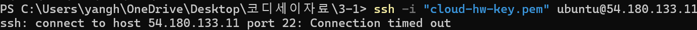
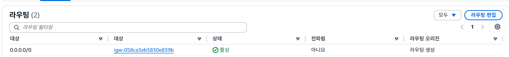
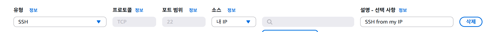
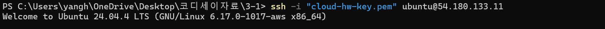

# 트러블슈팅 보고서 (Troubleshooting Report)

## 1. 개요
* **작성일자:** 2026-09-23
* **대상 시스템:** AWS VPC, 퍼블릭 서브넷, EC2 인스턴스 (`my-web-server`)
* **주요 이슈:** 
  1. 서브넷 생성 시 가용 영역에 서울(ap-northeast-2)이 아닌 시드니 리전만 노출되는 현상
  2. EC2 인스턴스 생성 후 SSH(`포트 22`) 원격 접속 시 `Connection timed out` 오류 발생

---

## 2. Case 1: 서브넷 가용 영역(AZ) 조회 오류 및 리전 설정 이슈

### ■ 2-1. 문제 상황 (Symptoms)
* 퍼블릭 서브넷을 생성하기 위해 AWS 콘솔의 서브넷 생성 화면으로 진입했으나, 가용 영역(AZ) 선택 목록에 서울 지역(`ap-northeast-2a` 등) 대신 시드니 리전(`ap-southeast-2`) 관련 영역만 노출되거나 원활하게 조회되지 않는 현상 발생.

### ■ 2-2. 원인 가설 (Hypothesis)
1. **가설 1:** AWS 콘솔의 현재 리전 설정이 기본값 또는 실수로 시드니 리전으로 지정되어 있어 해당 지역의 가용 영역만 표시되는 것일 가능성
2. **가설 2:** 신규 생성한 개인 AWS 계정에서 서울 리전이 비활성화(Disabled) 상태이거나 IAM/글로벌 뷰 권한 제한이 걸려 있을 가능성

### ■ 2-3. 검증 과정 (Verification)
1. **AWS 콘솔 우측 상단 리전 설정 확인:**
   * 콘솔 상단의 리전 선택 메뉴를 확인한 결과, 아시아 태평양 (시드니)로 설정되어 있음을 확인하여 **가설 1이 원인임을 최종 검증함**.

### ■ 2-4. 조치 내용 (Action)
* AWS 콘솔 상단 메뉴바의 리전 선택 버튼을 클릭하여 **[아시아 태평양 (서울) ap-northeast-2]** 리전으로 변경함.
* 필요 시 루트 계정으로 전환하여 계정 설정의 [AWS 리전] 메뉴에서 서울 리전의 활성화 상태를 확인하고 올바른 리전 환경에서 작업을 재개함.

### ■ 2-5. 결과 (Result)
* 리전을 서울로 변경한 후 서브넷 생성 화면으로 이동한 결과, 가용 영역 선택 목록에 `ap-northeast-2a`를 포함한 서울 지역의 가용 영역들이 정상적으로 노출되어 퍼블릭 서브넷을 성공적으로 생성함.


---

## 3. Case 2: SSH 원격 접속 타임아웃 (Connection timed out) 오류

### ■ 3-1. 문제 상황 (Symptoms)
* 로컬 터미널(PowerShell)에서 개인 키(`.pem`) 파일의 권한을 올바르게 설정한 뒤 SSH 접속을 시도했으나, 패킷이 응답하지 않고 아래와 같은 타임아웃 에러가 발생함:
  ```text
  ssh: connect to host 54.180.133.11 port 22: Connection timed out


* EC2 인스턴스는 정상적으로 '실행 중(Running)' 상태였으며 퍼블릭 IP 주소도 올바르게 입력된 상태였음.



### ■ 3-2. 원인 가설 (Hypothesis)

1. **가설 1:** EC2 인스턴스를 중지/시작하는 과정에서 퍼블릭 IP 주소가 변경되어 잘못된 주소로 접속을 시도했을 가능성
2. **가설 2:** 보안 그룹(Security Group)의 인바운드 규칙에서 SSH(22번 포트)의 소스(Source) 설정이 올바르지 않거나 허용되지 않은 IP 대역으로 지정되어 방화벽에서 트래픽이 차단되었을 가능성


3. **가설 3:** VPC 라우팅 테이블에 인터넷 게이트웨이(IGW) 경로가 누락되어 외부 네트워크와의 통신이 불가능한 상태일 가능성


### ■ 3-3. 검증 과정 (Verification)

1. **퍼블릭 IP 및 인스턴스 상태 확인:**
* AWS EC2 대시보드를 확인한 결과, 인스턴스는 '실행 중'이었고 퍼블릭 IP(`54.180.133.11`)도 기존과 일치함을 확인하여 **가설 1은 기각됨**.


2. **네트워크 라우팅 확인:**
* 퍼블릭 서브넷과 연결된 라우팅 테이블에 `0.0.0.0/0` → 인터넷 게이트웨이(`my-igw`) 경로가 정상적으로 설정되어 있음을 확인하여 **가설 3은 기각됨**.


3. **보안 그룹(Security Group) 인바운드 규칙 점검:**
* `web-server-sg` 보안 그룹의 인바운드 규칙을 확인한 결과, SSH(22) 포트의 소스(Source)가 현재 사용 중인 네트워크 환경의 공인 IP와 일치하지 않거나 전체 개방(`0.0.0.0/0`)이 차단된 상태여서 외부 접근이 거부되고 있음을 확인함.




> **[📸 사진추가 필요: EC2 인스턴스 실행 상태 및 보안 그룹 인바운드 규칙 설정 화면 캡처]**

### ■ 3-4. 조치 내용 (Action)

* 보안 그룹(`web-server-sg`)의 인바운드 규칙 편집 메뉴로 이동함.


* SSH(22번 포트) 규칙의 소스(Source)를 임의의 주소가 아닌 **'내 IP (My IP)'** 항목으로 재지정하여 현재 연결된 로컬 네트워크의 공인 IP 대역만 안전하게 허용하도록 수정함.





### ■ 3-5. 결과 (Result)

* 보안 그룹 수정 후 로컬 터미널에서 SSH 접속 명령어를 다시 실행한 결과, 타임아웃 없이 정상적으로 인증을 거쳐 Ubuntu 인스턴스 내부로 진입(`Welcome to Ubuntu`)하는 데 성공함.


```text
Welcome to Ubuntu 24.04.4 LTS...
ubuntu@ip-10-0-1-231:~$

```





---

## 4. 재발 방지 대책 (Prevention)

* **리전 사전 확인 습관화:** 클라우드 인프라 구축 작업 전반에 걸쳐 우측 상단의 리전 표시(서울, `ap-northeast-2`)를 먼저 확인하여 잘못된 리전 생성을 미연에 방지함.
* **네트워크 변경 시 IP 재확인:** 집, 카페, 학교 등 네트워크 환경(Wi-Fi)이 변경될 경우 공인 IP가 달라지므로, 보안 그룹의 SSH 소스(`내 IP`)가 최신 상태로 유지되는지 항상 먼저 점검함.


* **최소 권한 원칙 준수:** 보안 강화를 위해 향후에도 SSH(22번 포트)는 전면 개방(`0.0.0.0/0`)을 지양하고 반드시 관리자 개인 IP 대역으로만 제한하여 무차별 대입 공격 등의 보안 위협을 예방함.


```

```