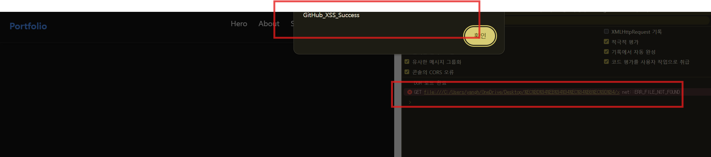

### 🔍 시큐어 코딩 전/후 어디가 어떻게 바뀌었나요?

핵심 차이는 **"문자열을 HTML 태그로 해석하느냐(`innerHTML`)"** vs "순수 텍스트 문자열로만 다루느냐(`textContent`)"에 있습니다.

#### 1. 변경 전 (취약한 코드)

```javascript
// ❌ innerHTML + 템플릿 리터럴 사용
projectList.innerHTML = projects.map(repo => `
  <div class="project-card">
    <h3>${repo.name}</h3>
    <p>${repo.description}</p> <!-- ⚠️ 공격자가 넣은  태그를 HTML로 해석함 -->
  </div>
`).join('');
```.
* **문제점:** `${repo.description}`에 포함된 특수문자(`<`, `>`, `"`)를 브라우저가 **실제 HTML 태그**로 인식합니다. 이로 인해 `` 태그의 `onerror` 이벤트 리스너가 트리거되어 악성 자바스크립트가 실행됩니다.

#### 2. 변경 후 (시큐어 코딩 적용 코드)
```javascript
// 🟢 DOM Element 직접 생성 + textContent 사용
projects.forEach(repo => {
  const card = document.createElement('div');
  const desc = document.createElement('p');

  // textContent를 사용해 문자열을 안전하게 이스케이프(Escape) 처리
  desc.textContent = repo.description || '설명 없음'; 

  card.appendChild(desc);
  projectList.appendChild(card);
});

```

* **개선점:** `textContent` 속성은 브라우저에 전달된 값을 HTML 태그가 아닌 순수 텍스트(Plain Text)로 강제 인식시킵니다.
* 내부적으로 `<` 문자가 `&lt;`, `>` 문자가 `&gt;`로 자동 이스케이프 변환되어, 스크립트가 실행되지 않고 화면에 단순 글자로만 표시됩니다.

---

### 📝 [기술 문서] Stored/DOM-Based XSS 분석 및 시큐어 코딩 보고서

아래 마크다운(Markdown) 코드를 그대로 복사해서 기술 블로그나 깃허브 보고서에 활용하시면 됩니다!

```markdown
---
layout: single
title: '[Web Security] GitHub API 연동 데이터의 Stored/DOM XSS 취약점 분석 및 시큐어 코딩'
tag : [Security, WebSecurity, XSS, SecureCoding, JavaScript, DOM]
categories: [Security, Web]
toc : true
toc_sticky: true
---

# GitHub API 데이터 렌더링 시 발생 가능한 XSS 분석 및 방어

## 1. 개요 (Overview)
포트폴리오 웹사이트에서 **GitHub Open API (`/users/{username}/repos`)**를 활용하여 저장소 정보(이름, 설명, 언어 등)를 비동기(`fetch`)로 불러와 화면에 렌더링하는 과정에서 **Stored / DOM-Based XSS(Cross-Site Scripting)** 취약점이 발생할 수 있음을 확인하고, 이를 **`textContent` 기반 시큐어 코딩**으로 방어한 실습 기록입니다.

---

## 2. 취약점 분석 (Vulnerability Analysis)

### 2-1. 취약점 발생 원인
기존 코드에서는 API로부터 받아온 저장소 설명(`repo.description`) 데이터를 이스케이프(Escape) 처리 없이 **템플릿 리터럴과 `innerHTML`**을 사용하여 DOM에 직접 주입하였습니다.

```javascript
// ❌ 취약한 기존 코드 (main_2.js)
projectList.innerHTML = projects.map(repo => `
  <div class="project-card">
    <h3>${repo.name}</h3>
    <p>${repo.description}</p> <!-- ⚠️ 외부 입력값이 HTML 태그로 해석됨 -->
  </div>
`).join('');

```

### 2-2. 공격 시나리오 (Attack Scenario)

1. **공격자 페이로드 주입**: 공격자는 본인의 GitHub 레포지토리 Description(설명)란에 아래와 같은 악성 스크립트 페이로드를 입력해 둡니다.
```html


```


2. **악성 데이터 수신**: 사용자가 포트폴리오 웹사이트에 접속하면 `fetchGitHubRepos()` 함수가 실행되며 GitHub API로부터 위 페이로드가 포함된 JSON 데이터를 수신합니다.
3. **스크립트 실행**: 수신된 데이터를 `innerHTML`에 대입하는 순간, 브라우저가 `` 태그를 정상적인 HTML 엘리먼트로 파싱합니다.
4. **결과**: 존재하지 않는 이미지 경로(`src=x`)로 인해 `onerror` 핸들러가 트리거되어 공격자가 의도한 악성 자바스크립트(`alert`)가 실행됩니다.




---

## 3. 시큐어 코딩 적용 (Secure Coding)

### 3-1. 방어 코드 (Refactored Code)

`innerHTML`을 통한 동적 HTML 생성을 배제하고, DOM 객체를 직접 생성하여 **`textContent`** 속성에 입력값을 대입하도록 수정하였습니다.

```javascript
// 🟢 시큐어 코딩 적용 코드 (main_2.js)
function renderProjects(projects) {
  const projectList = document.querySelector('#project-list');
  projectList.innerHTML = ''; // 기존 영역 초기화

  projects.forEach(repo => {
    const card = document.createElement('div');
    card.className = 'project-card';

    const h3 = document.createElement('h3');
    h3.textContent = repo.name; // textContent 적용

    //  [핵심 방어 지점] description을 textContent로 이스케이프 처리
    const desc = document.createElement('p');
    desc.textContent = repo.description || '설명 없음';

    const info = document.createElement('div');
    info.className = 'repo-info';
    info.textContent = `⭐ ${repo.stargazers_count} | 💻 ${repo.language || 'N/A'}`;

    const link = document.createElement('a');
    link.href = repo.html_url;
    link.target = '_blank';
    link.rel = 'noopener noreferrer';
    link.textContent = 'GitHub 방문하기 →';

    card.appendChild(h3);
    card.appendChild(desc);
    card.appendChild(info);
    card.appendChild(link);

    projectList.appendChild(card);
  });
}

```

---

## 4. 방어 결과 검증 (Verification)

* **원리**: `textContent` 속성은 전달받은 인자값을 단순 문자열(Plain Text)로 처리합니다. 브라우저는 내부적으로 `<`를 `&lt;`, `>`를 `&gt;`로 자동 이스케이프(Entity Encoding)합니다.
* **결과**: 수정 후 페이지를 새로고침하면, 스크립트 알림창이 실행되지 않고 화면 상에 `` 텍스트 자체가 안전하게 표기됨을 확인하였습니다.

---

## 5. 결론 및 시사점 (Conclusion)

* **외부 API 데이터 신뢰 금지**: 오픈 API나 DB에서 불러오는 데이터라 할지라도 검증되지 않은 외부 입력값(Untrusted Data)으로 간주해야 합니다.
* **`innerHTML` 사용 지양**: 사용자 입력이나 외부 데이터가 포함되는 영역에는 `innerHTML` 대신 `textContent` 또는 `innerText`를 사용하는 것이 DOM XSS를 예방하는 가장 근본적인 대책입니다.

```

```